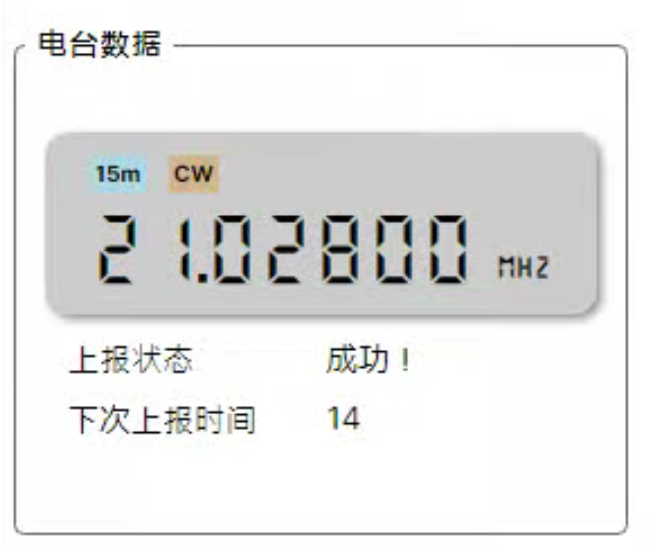
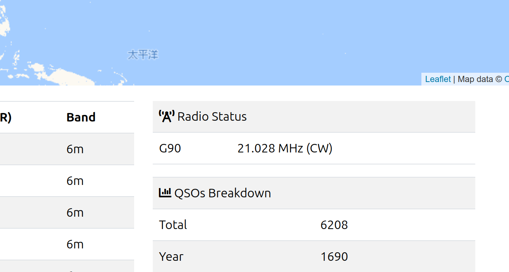

<div align="center">


# Cloudlog Helper


<br />

<br />


[🌍点此阅读中文版本](./readme_cn.md)

A lightweight `Cloudlog`/`Wavelog` companion app that automatically uploads current radio status and real-time QSO data. Supports most mainstream radios and works seamlessly with `JTDX`/`WSJT-X` and similar software!

If your computer struggles with performance or you simply need an automated QSO/radio status upload tool, give `Cloudlog Helper` a try!


</div>

## 💻 Supported Platforms

+ Windows 7 SP1+
+ Ubuntu 20.04+ or other mainstream Linux distributions
+ macOS support coming soon...

## ⚡️ Quick Start!

> [!TIP]
> You can also compile from source – see the "Compilation" section below.
+ Download the appropriate version for your system from `Releases`.

+ Launch the app and navigate to `Settings` -> `Basic Settings`.

### 📌 Cloudlog Configuration

+ Enter your Cloudlog/Wavelog server URL (referred to as Cloudlog) and corresponding API KEY. Follow these steps to obtain the URL and API KEY:

  

+ Click "Test". If entered correctly, a dropdown for selecting Station ID will appear below the API key field. If you have multiple stations configured in Cloudlog/Wavelog, select the correct ID here – all subsequent QSOs will be uploaded to this ID.

  

### 📌 Hamlib Configuration

> [!NOTE]
> Skip this step if you don't need automatic radio data upload.

> [!WARNING]
> When JTDX (or WSJT-X, referred to as JTDX) is running, it will monopolize radio control. Without proper JTDX configuration, this feature cannot be used simultaneously with JTDX. See the "Working with JTDX" section for solutions.

This app can periodically upload radio status (frequency, mode, etc.) to your Cloudlog server. When logging QSOs, Cloudlog will automatically fetch and populate these fields, reducing manual entry errors. Additionally, Cloudlog's main interface will display real-time radio status for reference.

+ Select your radio model from the dropdown.
+ Choose the correct COM port for your device.
+ Click "Test". After successful testing, check "Enable automatic radio data upload" and click "Confirm" to save.


+ The main interface should now display radio information. Your Cloudlog homepage should show the radio status:

 

+ Under "Station", select your radio. Cloudlog will now auto-fill frequency/mode when logging QSOs.


### 📌 UDP Server Configuration

This works similarly to `GridTracker`. JTDX broadcasts decoded callsigns, frequencies, and signal reports via UDP, which `CloudlogHelper` receives and uploads to your Cloudlog server.

+ Minimal configuration needed. If you change the port here, ensure JTDX's UDP settings match. **Note: If JTDX and Cloudlog Helper run on different machines, check "Allow external connections" and set JTDX's UDP server IP to Cloudlog Helper's host IP.**


+ The main interface will now display JTDX transmission status or completed QSOs.


## 🚀 Advanced
### 🎯 Working with JTDX
To enable radio data upload while JTDX is running:

When JTDX is active, it exclusively controls the radio, preventing this app from reading frequency data. However, both JTDX and Cloudlog Helper use Hamlib, and JTDX supports control via rigctld. We can run a rigctld instance for shared access:

(Windows 7 example):

+ In Cloudlog Helper's settings, configure your radio and enable "Automatic radio data upload". **Do not** check `Disable PTT control` – JTDX requires this for transmission.

  

+ Click "Apply Changes".

+ In JTDX, go to `Settings` -> `Radio`, change `Radio Device` to `Hamlib NET rigctl`, set CAT control server to `127.0.0.1:4534`, and keep PTT method unchanged:

  

+ Test CAT and PTT functionality, then confirm.

+ CloudlogHelper and JTDX are now working together.

  

> [!WARNING]  
> Occasional "Connection forcibly closed" errors are normal due to polling conflicts between JTDX and this app. Increase this app's polling interval (10-30s) to reduce frequency. Future updates may improve this.

## 🛠️ Compilation
Ensure your environment has `.NET 6.0+` and `gcc`. (Linux instructions)

Clone the repository:
```shell
git clone --recursive --depth=1 https://github.com/SydneyOwl/cloudlog-helper.git
```

### 🔨 Compile Hamlib
Skip if you don't need radio data functionality.

We only need `rigctld` from Hamlib:
```shell
# Dependencies
sudo apt install build-essential gcc g++ cmake make libusb-dev libudev-dev

cd cloudlog-helper/hamlib
./bootstrap

# Optimized build (similar to WSJT-X)
./configure --prefix=<INSTALL_DIR> --disable-shared --enable-static --without-cxx-binding \
CFLAGS="-g -O2 -fPIC -fdata-sections -ffunction-sections" \
LDFLAGS="-Wl,--gc-sections"

make -j4 all
make install-strip DESTDIR=""
```
Find `rigctld` in `/<INSTALL_DIR>/bin`.

### 🔨 Compile the Application
```shell
cd cloudlog-helper
dotnet restore -r linux-x64
dotnet publish -c Release -r linux-x64 /p:PublishSingleFile=true --self-contained true
```
The compiled app will be in `bin/Release/net6.0/linux-64`. Copy `rigctld` here if compiled.

## ✨ Miscellaneous
### 🐆 Performance
Tested on low-end hardware (Windows 7 SP1 x64, i5-3337U, 8GB RAM) running `Rustdesk` + `JTDX` + `Cloudlog helper` + `NetTime v3.14`.

After 1 hour of FT8 operation:(CPU spikes occur during decoding cycles.)


## 📝 License
`Cloudlog Helper` is free and unencumbered software released into the public domain. Anyone may use, modify, distribute, or sell this software for any purpose without restrictions.

Full license details in [Unlicense](./LICENSE).