<div align="center">
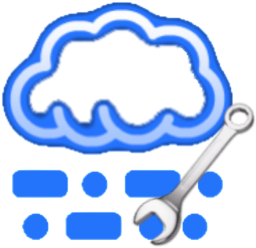

# Cloudlog Helper


<br />

<br />


[**🌍阅读中文版本**](./readme_cn.md)

A lightweight companion utility for Cloudlog/Wavelog that automatically uploads current rig status and real-time QSO
data. Supports most mainstream radios and seamless integration with JTDX/WSJT-X!

If your computer struggles with performance or you simply need an automated QSO/rig data upload solution, give Cloudlog
Helper a try!

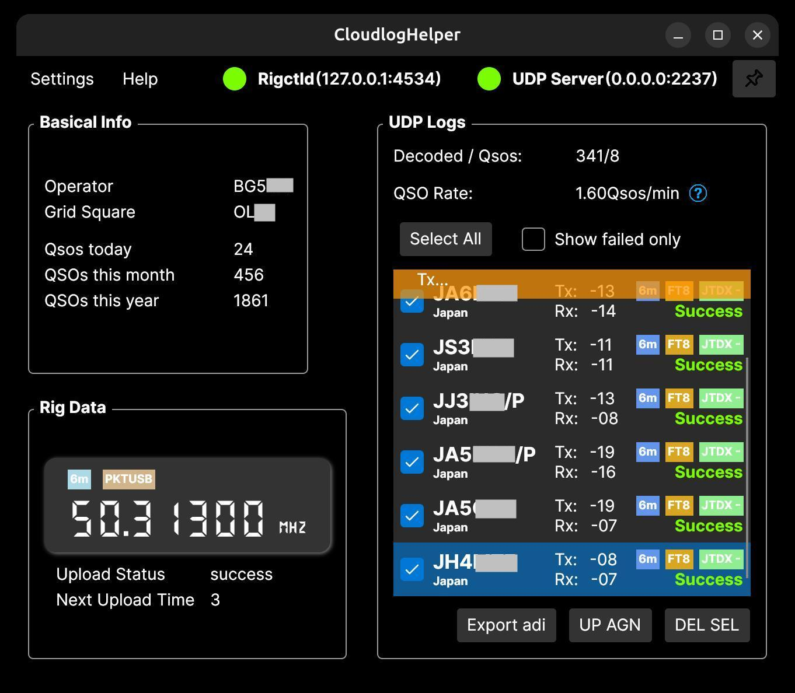

</div>

## 💻 Supported Platforms

+ Windows 7 SP1+
+ Ubuntu 20.04+ or other mainstream Linux distributions
+ macOS support is in progress...

## ⚡️ Quick Start!

> [!TIP]
> You can also choose to compile the software yourself. Refer to the `Compilation` section below.

+ Download the software for your system from the `Release` section. If you're using Linux and need the radio data
  reporting feature, launch the software with `sudo`.

+ Open the software, click `Settings` -> `Basic Settings` to access the configuration page.

### 📌 Cloudlog Configuration

+ Enter your Cloudlog / Wavelog server (hereafter referred to as Cloudlog) address and the corresponding API KEY. You
  can obtain the URL and API KEY by following the steps shown in the image below:

  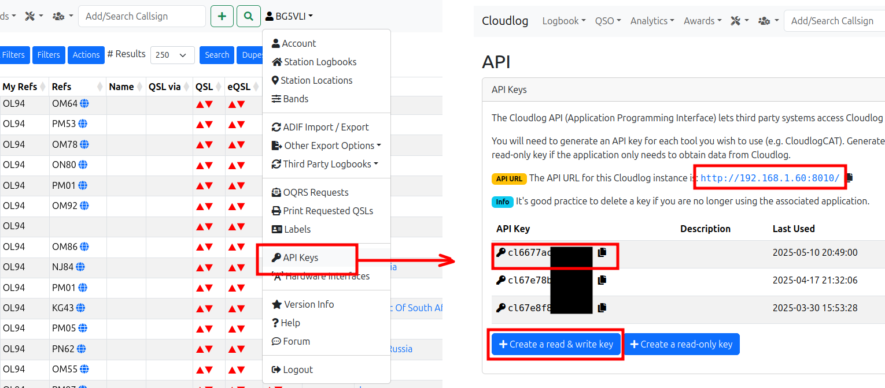

+ Click "Test." If your input is correct, a dropdown for selecting the Station ID will appear below the API KEY. If you
  have multiple stations set up in Cloudlog / Wavelog, select the correct ID here. All subsequent QSOs will be uploaded
  to this ID.

  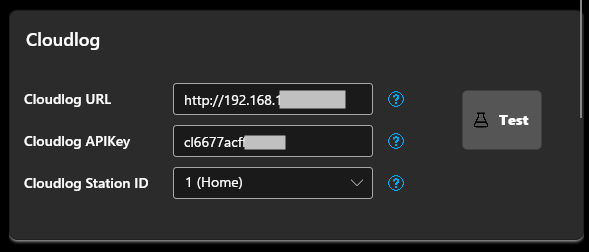

### 📌 Clublog Configuration

+ Enter the callsign, email, and password you used when registering on Clublog.

  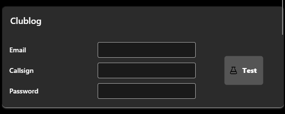

+ Click "Test." If the test passes, you can enable "Automatically upload QSOs to Clublog" in the "UDP Settings."

  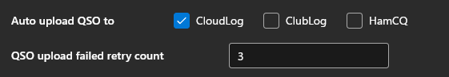

### 📌 Hamlib Configuration

> [!NOTE]
> If you don’t need automatic radio data upload, you can skip this step.

> [!WARNING]
> When JTDX (or WSJT-X, hereafter referred to as JTDX) is running, it will monopolize control of the radio. Therefore,
> this feature and JTDX cannot be enabled simultaneously unless JTDX is properly configured. Refer to the
`Working with JTDX` section for a solution.

This software can periodically upload radio information (frequency, mode, etc.) to your Cloudlog server. When logging a
QSO, Cloudlog will automatically fetch the current frequency, mode, and other data to populate the corresponding fields,
reducing manual input errors. Additionally, the Cloudlog interface will display real-time radio frequency and mode
information for reference.

+ Select your radio model from the `Radio Model` dropdown.
+ Choose the port where your device is connected under `Device Port`.
+ Click the "Test" button. Only after a successful test should you check "Enable automatic radio data reporting."
  Click "Confirm" to save the settings.

  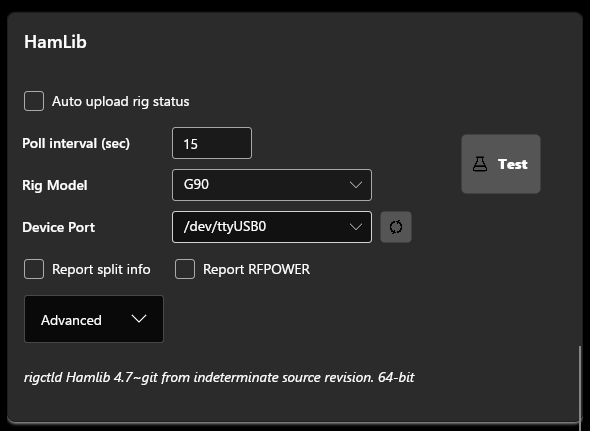

+ The software’s main interface should now display the retrieved radio information. Open your Cloudlog website, and the
  homepage should show your radio details:

  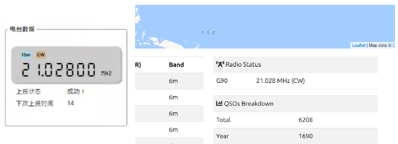

+ Under "Station," select your radio. From then on, when filling in QSO details, Cloudlog will automatically populate
  the frequency, mode, and other information.

  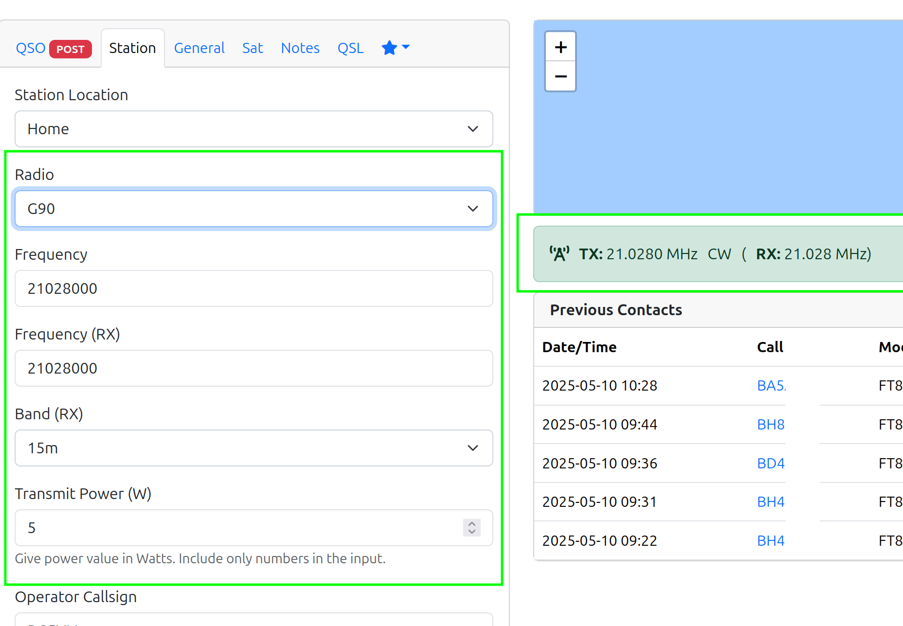

### 📌 UDP Server Configuration

This feature works similarly to `GridTracker`. `JTDX` broadcasts decoded callsigns, frequencies, signal reports, etc.,
via the UDP protocol, and `CloudlogHelper` receives and decodes this information, uploading the QSO results in real time
to your Cloudlog server.

+ Minimal configuration is required here. If you change the port number, ensure the UDP server settings in JTDX are
  updated accordingly. **Note: If JTDX and Cloudlog Helper are not running on the same machine, you must enable "Allow
  external connections" and set the UDP server IP address in JTDX to the IP of the machine running Cloudlog Helper.**

  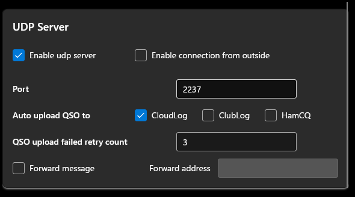

+ After this setup, the software’s main interface will display relevant information when JTDX is in transmit mode or
  after completing a QSO.

  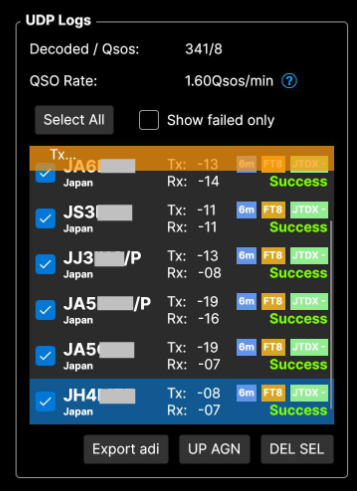

### 🔧 Utility Tools

#### 🔧 QSO Upload Assistant

This tool automatically downloads uploaded QSOs from your Cloudlog server and compares them with local QSO records(*
*Currently only wsjtx and jtdx format log is supported.**). It identifies and automatically uploads any missing QSOs.
For example, if you started JTDX but forgot to launch your logging software, or if your network connection was
accidentally interrupted, this tool will help recover those unuploaded QSOs.

  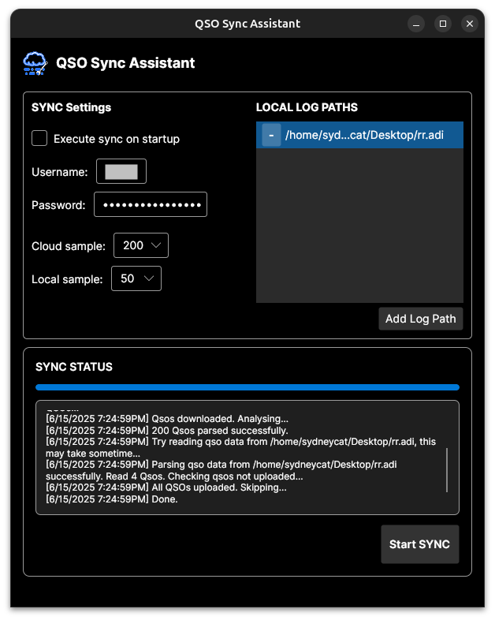

| Configuration Item          | Description                                                                                                                                                      |
|-------------------------|---------------------------------------------------------------------------------------------------------------------------------------------------------|
| Execute sync on startup | If checked, the tool will automatically launch and start syncing every time the software starts.                                                                                                                     |
| Username                | Your Cloudlog login username.                                                                                                                                         |
| Password                | Your Cloudlog password.                                                                                                                                            |
| Cloud Sample (days)     | The number of recent QSOs downloaded from Cloudlog by day, which will be used as reference data for comparison with local QSOs.<br/>Adjust this based on your needs. If you have fewer QSOs, set a higher value to ensure enough sample data is downloaded to cover local QSOs. **For example, setting it to `10` means the tool will fetch the latest 10 days of QSO records from the cloud.** |
| Local Sample (QSOs)     | The number of recent QSO records loaded from the local log file for comparison with cloud records. For example, setting it to `50` means the tool will check whether the latest 50 local QSOs have been uploaded to the cloud (i.e., whether they exist in the cloud's latest QSOs, as defined by the Cloud Sample setting).                                        |
| Local Log Paths         | Path(s) to your local log file(s). |

## 🚀 Advanced

### 🎯 Working with JTDX/WSJT-X

If you want to report radio data in real time while JTDX is running, follow these steps. The process for WSJT-X is
similar.

When JTDX is running, it monopolizes control of the radio, preventing this software from reading the frequency.
Fortunately, both JTDX and this software can use Rigctld as the radio control backend. Simply adjust JTDX’s network
server settings to share a single Rigctld backend with this software.

> [!IMPORTANT]
> Do not set the polling intervals for JTDX and this software too short. Excessive requests may overwhelm the radio. A
> recommended value is 8s for JTDX (under Settings -> Radio) and 15s for this software. **Ensure the intervals are not
integer multiples of each other.**

Here’s how to set it up (using Windows 7 as an example):

+ Open Cloudlog Helper, go to "Settings," enter your radio details, and enable "Automatic radio data reporting." **Do
  not** check `Disable PTT Control`, as JTDX relies on this feature for transmission.

+ Click "Apply Changes."

+ Open `JTDX`, go to `Settings` -> `Radio`, change `Radio Device` to `Hamlib NET rigctl`, and set the CAT control’s
  network server to the Rigctld backend address (default: `127.0.0.1:4534`). Leave the PTT method unchanged.

  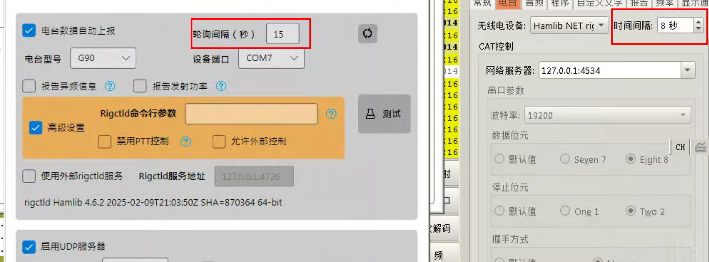

+ Test CAT and PTT functionality, then click "OK."

+ You’ve now successfully enabled collaboration between CloudlogHelper and JTDX.

  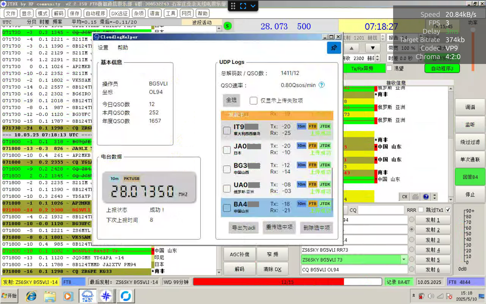

### 🎯 Configuration Details

#### ⚙️ Hamlib Settings

| Setting                             | Description                                                                                                                                                                                                                                                   |
|-------------------------------------|---------------------------------------------------------------------------------------------------------------------------------------------------------------------------------------------------------------------------------------------------------------|
| Automatic radio data reporting      | If enabled, the software will upload radio data to the specified Cloudlog server.                                                                                                                                                                             |
| Polling interval                    | Interval (in seconds) for querying radio data from the Rigctld backend. Default: 9s.                                                                                                                                                                          |
| Radio model                         | The model of your radio. The list is fetched from Rigctld, so all Hamlib-supported radios are theoretically supported.                                                                                                                                        |
| Device port                         | The port where your radio is connected.                                                                                                                                                                                                                       |
| Report split frequency              | Query split frequency (different TX/RX frequencies) from Rigctld. Some radios may not support this or return incorrect data.                                                                                                                                  |
| Report TX power                     | Query current transmit power from Rigctld. Some radios may not support this or return incorrect data.                                                                                                                                                         |
| Advanced: Rigctld command-line args | Manually specify Rigctld startup arguments. This takes highest priority; if set, other settings (e.g., disable PTT/allow external control) are ignored. **If manually specifying args, you must explicitly set Rigctld’s IP and port (`-T <ip> -t <port>`).** |
| Advanced: Disable PTT control       | Disable RTS/DTR control at startup (adds `--set-conf=""rts_state=OFF"" --set-conf ""dtr_state=OFF""`). Only needed on some Linux systems. Do not enable if working with JTDX or other third-party software.                                                   |
| Advanced: Allow external control    | Allow non-localhost devices to interact with Rigctld (adds `-T 0.0.0.0`).                                                                                                                                                                                     |
| ~~Advanced: Enable request proxy~~  | ~~Start a proxy server to forward external requests to Rigctld.~~ (Deprecated)                                                                                                                                                                                |
| Use external Rigctld service        | Use an external Rigctld instance as the backend (e.g., if you manually started one).                                                                                                                                                                          |

#### ⚙️ UDP Server Settings

| Setting                      | Description                                                                |
|------------------------------|----------------------------------------------------------------------------|
| Enable UDP server            | Start a UDP server to receive QSO data from third-party software.          |
| Port number                  | UDP server port.                                                           |
| Allow external connections   | Allow requests from non-localhost devices.                                 |
| Auto-upload QSOs to Cloudlog | Automatically upload received QSOs to the specified Cloudlog server.       |
| Auto-upload QSOs to Clublog  | Automatically upload received QSOs to the specified Clublog server.        |
| QSO upload retry attempts    | Number of retries for failed QSO uploads.                                  |
| Forward UDP packets          | Forward received UDP packets to specified UDP server, such as GridTracker. |

Here's a more polished and natural version for a README file:

#### ⚙️ Command Line Options

| Option             | Description                                                                 |  
|--------------------|-----------------------------------------------------------------------------|  
| `--verbose`        | Enable verbose logging (Trace level)                                        |  
| `--log2file`       | Save logs to file (stored in `./log/xxxx`)                                  |  
| `--reinit-db`      | Force database reinitialization                                             |  
| `--dev`            | Developer mode - disables crash reporting dialog                            |  
| `--udp-log-only`   | Minimal UI mode - only shows UDP log upload functionality                   |  
| `--crash-report`   | [Internal] Specify crash log directory (used by error reporting system)     |  

## 🛠️ Compilation

Ensure your environment has `.NET 6.0+` and `gcc`. The steps below are for Linux x64; other platforms can refer to
`.github/workflows/build.yml`.

First, clone the repository:

```shell
git clone --recursive --depth=1 https://github.com/SydneyOwl/cloudlog-helper.git
```

### 🔨 Compiling Hamlib

Skip this step if you don’t need radio data reporting. The software can run without Hamlib.

We only need `rigctld`, a radio control daemon from the Hamlib toolkit that allows remote control via TCP:

```shell
# Install dependencies
sudo apt install build-essential gcc g++ cmake make libusb-dev libudev-dev

cd cloudlog-helper/hamlib
./bootstrap

# Optimize for size (similar to WSJT-X’s CMakeLists)
./configure --prefix=<INSTALL_DIR> --disable-shared --enable-static --without-cxx-binding \
CFLAGS="-g -O2 -fPIC -fdata-sections -ffunction-sections" \
LDFLAGS="-Wl,--gc-sections"

make -j$(nproc) all
make install-strip DESTDIR=""
```

After compilation, `rigctld` will be in `./<INSTALL_DIR>/bin`.

### 🔨 Compiling the Software

Run:

```shell
cd cloudlog-helper
dotnet restore -r linux-x64
dotnet publish -c Release -r linux-x64 /p:PublishSingleFile=true --self-contained true
```

The compiled software will be in `bin/Release/net6.0/linux-64`. Copy `rigctld` (if needed) here to complete the setup.

## ✨ Miscellaneous

### 🐆 Performance Analysis

A simulated FT8 remote operation scenario was tested on low-end hardware (Windows 7 SP1 x64, i5-3337U, 8GB RAM), running
`Rustdesk` + `JTDX` + `Cloudlog Helper` + `NetTime v3.14`.

After 1 hour, CPU and memory usage were as follows (spikes correspond to decoding cycles):

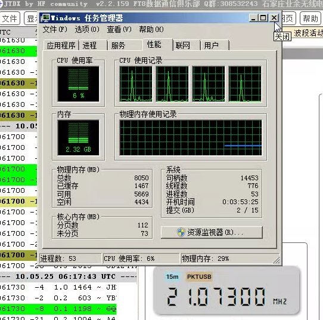

## 🙏 Acknowledgments

+ [Hamlib](https://github.com/Hamlib/Hamlib): An amateur radio equipment control library (supports radios, rotators, tuners, and amplifiers).
+ [WsjtxUtils](https://github.com/KC3PIB/WsjtxUtils): A C# class library and sample code for interacting with WSJT-X via UDP interface using .NET & .NET Framework 4.8.
+ [ADIFLib](https://github.com/kv9y/ADIFLib): A C# library for reading, parsing, and writing ADIF (version 3.1.0) files.
+ [FT8CN](https://github.com/N0BOY/FT8CN): Run FT8 on Android. The call sign attribution logic and corresponding DXCC Chinese translations in this software are extracted from it.

## 📝 License

Cloudlog Helper is a free and unencumbered software released into the public domain.
Anyone is free to copy, modify, publish, use, compile, sell, or
distribute this software, either in source code form or as a compiled
binary, for any purpose, commercial or non-commercial, and by any
means.

Complete license terms available in the [Unlicense](./LICENSE) file.

## ⚠️ DISCLAIMER

1. Software Usage

   Cloudlog Helper is a free and open-source software designed to assist amateur radio enthusiasts with Cloudlog/Wavelog
   integration. Users are free to download, use, or modify this software, but all usage is at their own risk. The
   developers and contributors shall not be held liable for any direct or indirect damages arising from the use of this
   software, including but not limited to:
    + Data loss or corruption
    + Malfunction or failure of radio equipment
    + Network communication issues
    + Other consequences caused by software incompatibility, configuration errors, or improper operation.

2. Functional Limitations

    + Testing Phase Notice: This software is currently in the UNDER TESTING stage and may contain undiscovered defects
      or instability. Users are advised to back up critical data before use and avoid relying solely on this software
      for essential operations.
    + Third-Party Dependencies: This software relies on libraries/tools such as Hamlib and JTDX/WSJT-X. Its
      functionality and compatibility are subject to the limitations of these components. The developers cannot
      guarantee support for all devices or software configurations.

3. Data Security & Privacy

    + Users are solely responsible for securing sensitive data (e.g., Cloudlog/Wavelog API Keys, Clublog credentials).
      This software does not actively collect or store such information, but risks due to user device or network
      vulnerabilities remain the user’s responsibility.
    + QSO data received via the UDP server is processed locally by default. Enabling "Allow External Connections" may
      introduce security risks—configure with caution.

4. Equipment Operation Risks

    + When controlling radios via Hamlib, adhere to the manufacturer’s guidelines. Incorrect polling intervals or
      configurations may cause device abnormalities. Initial testing without physical radio connection is recommended.
    + Coordination with JTDX/WSJT-X requires avoiding port conflicts or control contention. The developers assume no
      liability for device damage caused by configuration errors.
