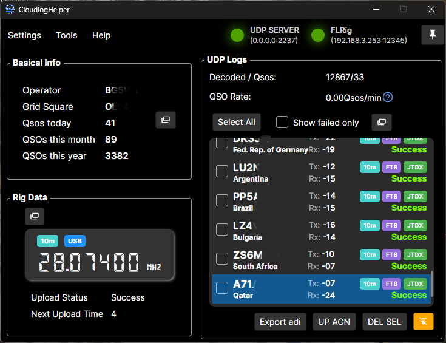
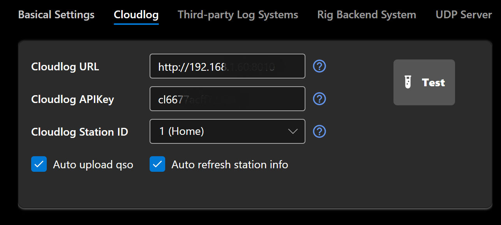
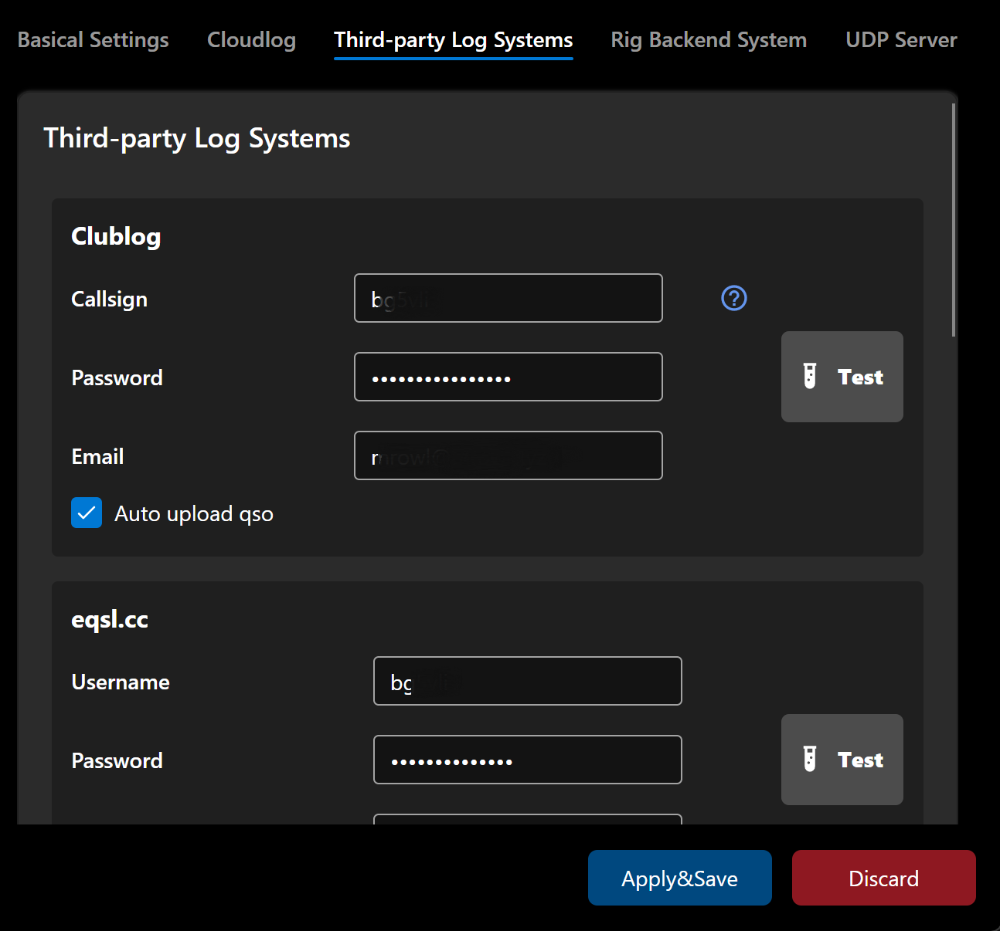

# Cloudlog Helper [](https://deepwiki.com/SydneyOwl/cloudlog-helper)


Cloudlog Helper is a lightweight, cross-platform, portable application that automatically syncs real-time rig data and QSO information to multiple logging platforms. 
While providing first-class support for Cloudlog and Wavelog, it also functions as a powerful, stand-alone logging tool in its own right!

+ Automatically syncs radio and QSO data across multiple platforms.
+ Supports both `Hamlib`/`FLRig`/`OmniRig` for radio control and seamlessly working with `JTDX`, `WSJT-X` or other compatible software.
+ Includes a rich set of charts and utilities - polar signal map, distance distribution map, global heatmap, QSO comparison assistant, etc.,
+ Portable and installation-free — ready to run right out of the box.
+ Native support for Windows and Linux, with macOS currently in development.
+ Easily integrates with new logging systems and custom backends, with support for pushing radio and decoded QSO data to user-defined APIs.
+ Optimized for resource-constrained environments — runs reliably on low-end hardware.

<p align="center">
  
  <br />
  
</p>

**(Some call signs have been anonymized)**

**⚠️ This is an UNOFFICIAL community project. It is NOT endorsed by, directly affiliated with, maintained, or sponsored by the `Cloudlog`/`Wavelog` development teams.**


## 💻 Supported Platforms

+ Windows 7 SP1+
+ Debian 9+ / Ubuntu 18.04+ / Other distributions (glibc >= 2.24)
+ macOS support in progress...

> [!WARNING]
> For **win7** users: ClubLog's API appears to only support TLS 1.2 and higher protocols. 
> Therefore, to use the ClubLog upload feature, you need to first install [Patch `KB3140245`](https://support.microsoft.com/en-us/topic/update-to-enable-tls-1-1-and-tls-1-2-as-default-secure-protocols-in-winhttp-in-windows-c4bd73d2-31d7-761e-0178-11268bb10392) 
> to enable TLS 1.2 support on your system.
> 
> In short: Install `KB3140245` from [here](https://catalog.update.microsoft.com/search.aspx?q=kb3140245) then [easyfix](https://download.microsoft.com/download/0/6/5/0658B1A7-6D2E-474F-BC2C-D69E5B9E9A68/MicrosoftEasyFix51044.msi) from here.


## ⚡️ Quick Start!

> [!TIP]
> You can also choose to compile it yourself. Please refer to the `Compilation` section below.

+ Download the software version for your system from `Releases`. If you're using Linux and **need to use the hamlib backend** for radio data reporting, please start the software with sudo.

+ Open the software, click `Settings` -> `Basic Settings` to open the settings page.

### 📌 Basic Settings

Please enter your Maidenhead locator (4 characters) here.


### 📌 Cloudlog/Wavelog Configuration

Enter your Cloudlog / Wavelog server (hereinafter referred to as Cloudlog) address and corresponding API KEY, then click "Test". If entered correctly, a dropdown for selecting the station ID will appear below the API key. If you have multiple stations set up in Cloudlog / Wavelog, please select the correct ID here. Subsequent QSOs will be uploaded to this ID.



### 📌 Third-party Logging System Configuration

> [!NOTE]
>
> You can also add your own logging services. See below for details.

This software supports uploading logs to:

+ Cloudlog / Wavelog
+ Clublog
+ eqsl.cc
+ HamCQ
+ HRDLOG
+ LoTW
+ QRZ.com

Enter your call sign/password or other configuration information in the corresponding fields.



### 📌 Radio Configuration

> [!NOTE]
>
> If you don't need automatic radio data upload functionality, you can skip this step directly.

> [!WARNING]
>
> Multiple rig backends cannot be enabled simultaneously.

This software supports `Hamlib` / `FLRig` / `OmniRig` as control backends for radios, allowing periodic uploads of radio information
(frequency, mode, etc.) to your Cloudlog server, HRDLog, or other specified backends. When you need to record QSO information, 
Cloudlog will automatically retrieve the current frequency, mode, or other data, and automatically populate the corresponding 
input fields to avoid manual entry errors. Meanwhile, the Cloudlog main interface will also display the radio's frequency, mode,
and other information in real-time for reference during operation.


> [!WARNING]
>
> If you **use Hamlib** as the control backend, since opening JTDX (or WSJT-X, hereinafter referred to as JTDX) will obtain exclusive control of the radio,
> this feature and JTDX cannot be enabled simultaneously before configuring JTDX. Please check the `Working with JTDX` section for solutions.

+ For Hamlib, Select your radio model from `Radio Model` dropdown and choose the port where your device is located in the `Device Port` field. For FLRig, input correct ip address and port.

+ Click the "Test" button. Only after successful testing should you check "Automatic Radio Data Reporting". Click "Confirm" to save the configuration.

  

+ The software's main interface should now display the retrieved radio information. Open your Cloudlog website, and the homepage should show your radio information:

  

+ Select your radio in "Station". Thereafter, when you fill in QSO information, Cloudlog will automatically populate frequency, mode, and other details for you.

  

### 📌 UDP Server Configuration

This part works similarly to `GridTracker`. `JTDX` broadcasts information about currently decoded call signs, frequencies, signal reports, etc., via UDP protocol, and `CloudlogHelper` receives and decodes this information, uploading the communication results to your Cloudlog server in real-time.

+ This part doesn't require much configuration. If you change the port number here, please also update the UDP server configuration in JTDX. **Note: If JTDX and Cloudlog Helper are not running on the same machine, you need to check the "Allow External Connections" option and change the IP address part of the UDP server in JTDX to the IP of the machine running Cloudlog Helper.**
  
  
  
+ Thereafter, when JTDX is in transmit mode or completes a QSO, the software's main interface will display the corresponding information.

## 🚀 Advanced

### 📊 Charts - Signal Distribution Polar Plot

This chart displays the azimuth and distance distribution of received signals on a polar coordinate system, where the **polar coordinate origin** is the geographic location corresponding to the **"My Maidenhead Grid"** you entered in the settings.

The calculated distance is the **great-circle distance**, and the angle is the **true north azimuth**. Darker signal points indicate higher communication density in that area. For example, the chart below clearly shows that most signals come from Europe, Japan, and Indonesia.

When "Auto Select" is checked and status information from `wsjt-x` or `jtdx` is received, the chart will automatically switch bands and display the QSO distribution that meets the criteria.


| Configuration Item | Description |
|-------------------|-------------|
| Display Density Colors | Calculate the density estimate for each signal point using the KNN algorithm based on the given k-value, distance, and angle weights. Map the density values to corresponding colors according to the selected colormap, and finally present it as a heatmap on the polar plot. This step is computationally intensive and can be disabled when the data volume is too large or device performance is poor. |
| Filter Duplicate Samples | Remove duplicate data by call sign. |
| Maximum Sample Points | Number of signal points displayed on the polar plot. Recommended within 1000, maximum support 8000. |
| K Value | K-nearest neighbors algorithm parameter that affects density calculation accuracy. |
| Distance Weight | Weight of distance in density calculation. |
| Angle Weight | Weight of angle in density calculation. |

### 📊 Charts - Station Statistics

From left to right, top to bottom, the displayed charts are:

+ Top 10 decoded DXCCs
+ Station distance distribution
+ Station azimuth distribution
+ Heatmap worldwide

Similarly, when "Auto Select" is checked and status information from `wsjt-x` or `jtdx` is received, the charts will automatically switch bands and display the QSO distribution that meets the criteria.


### 🔧 Utilities - QSO Upload Assistant

This tool can automatically download uploaded QSOs from your Cloudlog server, compare them with local QSOs (**currently only supports Wsjtx and JTDX format logs**), filter out unuploaded QSOs, and help you automatically upload and complete them. For example, if you started jtdx but forgot to start the logging software, or the network was accidentally disconnected unnoticed, there might be missed QSOs not uploaded. This tool aims to solve this problem.

  

| Configuration Item | Description |
|-------------------|-------------|
| Execute sync on startup | If checked, this tool will open and automatically start synchronization every time the software starts. |
| Username | Cloudlog login username. |
| Password | Cloudlog password. |
| Cloud Sample (days) | Number of latest QSOs downloaded from Cloudlog by days. These QSOs will serve as baseline data for comparison with local QSOs.<br/>Please set according to your needs. If communication is infrequent, this value should be appropriately larger to ensure the downloaded cloud QSO sample size is sufficient to cover local QSOs. **For example, setting it to `10` means the tool will get the latest 10 days of QSO records from the cloud.** |
| Local Sample (QSOs) | Number of recent QSO records read from local log files for comparison with cloud records. For example, setting it to `50` means the tool will check if the latest 50 local QSOs have all been uploaded to the cloud (i.e., whether they all exist in the latest QSOs downloaded from the cloud, with quantity equal to Cloud Sample). |
| Local Log Paths | Local log paths. |

### 🎯 (Hamlib only) Working with JTDX/WSJT-X

If you wish to report radio data in real-time while JTDX is running, please refer to the following. The process for WSJT-X is similar.

When JTDX is running, it holds exclusive control over the radio, preventing this software from reading the radio frequency. Fortunately, both JTDX and this software can use Rigctld as the radio control backend. You simply need to modify the network server address in JTDX so that both this software and JTDX share the same Rigctld backend.

> [!IMPORTANT]
>
> Do not set the polling intervals for JTDX and this software too short. Excessive data requests may cause the radio to respond slowly or error out. A recommended value is to set the time interval in JTDX's Settings -> Radio to 8s, and this software's polling interval to 15s.
> **Please note that the intervals should not be integer multiples of each other.** This helps to prevent both programs from polling the radio simultaneously, which could overload it.

Here are the specific steps (using Windows 7 as an example):

+ Open Cloudlog Helper, go to the "Settings" page, fill in the radio information, and check "Automatically Report Radio Data". Note: **Do not** check `Disable PTT Control`. JTDX relies on this feature to control radio transmission.

+ Click "Apply Changes".

+ Open `JTDX`, go to `Settings` -> `Radio`, change `Radio Equipment` to `Hamlib NET rigctl`. In CAT control, set the Network Server to the Rigctld backend address (default is 127.0.0.1:4534). Keep the PTT Method configuration unchanged.

  

+ After testing that both CAT and PTT are functional, click "OK".

+ You have now successfully enabled collaboration between CloudlogHelper and JTDX.

  

### 🎯 Configuration Item Descriptions

#### ⚙️ Hamlib Configuration

| Configuration Item               | Description                                                                                                                                                                                                                             |
| -------------------------------- | --------------------------------------------------------------------------------------------------------------------------------------------------------------------------------------------------------------------------------------- |
| Automatically Report Radio Data  | If checked, the software will automatically upload retrieved radio information to the specified Cloudlog server.                                                                                                                        |
| Polling Interval                 | Specifies the time interval (in seconds) for querying the Rigctld backend for radio data. Default is 9 seconds.                                                                                                                          |
| Radio Model                      | The model of the radio currently in use. The list of models is read from Rigctld, so theoretically, any radio supported by Hamlib is supported by this software.                                                                         |
| Device Port                      | The port where the radio is connected.                                                                                                                                                                                                  |
| Report Split Frequency Info      | Requests split frequency information (using different frequencies for receiving and transmitting) from Rigctld during polling. **Some radios do not support this feature or may return incorrect data.**                                 |
| Report Transmit Power            | Requests the current transmit power from Rigctld during polling. **Some radios do not support this feature or may return incorrect data.**                                                                                               |
| Advanced - Rigctld Command Line Args | Manually specify the command line arguments for starting the Rigctld backend. This has the highest priority. If this field is not empty, other related configurations (Disable PTT Control / Allow External Control) will be ignored. **If you choose to specify command line arguments manually, you must explicitly specify the Rigctld IP address and port (`-T <ip> -t <port>`). The software will read the port from the command line arguments.** |
| Advanced - Disable PTT Control   | Disables RTS and DTR control on startup (adds parameters `--set-conf="rts_state=OFF" --set-conf="dtr_state=OFF"`). Typically only needed on some Linux systems. Should not be checked if working with third-party software like JTDX.    |
| Advanced - Allow External Control| Allows interaction with the Rigctld backend from devices other than localhost (adds parameter `-T 0.0.0.0`).                                                                                                                             |
| ~~Advanced - Enable Request Proxy~~ | ~~Starts a proxy server that can forward external requests into the software, which then automatically sends them to Rigctld based on priority.~~ (Deprecated/Removed)                                                                       |
| Use External Rigctld Service     | Use an external Rigctld instance as the software's Rigctld backend. For example, if you manually started a Rigctld instance, check this option and configure the software to use your specified Rigctld backend.                         |

#### ⚙️ UDP Server Configuration

| Configuration Item         | Description                                                                                             |
| -------------------------- | ------------------------------------------------------------------------------------------------------- |
| Enable UDP Server          | Starts a UDP server to receive QSO data sent from third-party software.                                 |
| Port Number                | The port number for the UDP server.                                                                     |
| Allow External Connections | Allows receiving requests from devices other than localhost.                                            |
| QSO Upload Retry Attempts  | Specifies the number of retry attempts for failed QSO uploads.                                          |
| Forward UDP Packets        | Forwards received UDP packets to the specified UDP server, e.g., to GridTracker.                        |

#### ⚙️ Command Line Arguments

| Argument               | Description                                                                 |
| ---------------------- | --------------------------------------------------------------------------- |
| `--verbose`            | Prints Trace-level logs.                                                    |
| `--log2file`           | Records logs to a file. Path is `./log/xxxx`.                               |
| `--reinit-db`          | Reinitializes the database.                                                 |
| `--reinit-settings`    | Reinitializes the settings.                                                 |
| `--reinit-hamlib`      | Reinitializes Hamlib configurations.                                        |
| `--dev`                | Does not launch the crash log collection window.                            |
| `--udp-log-only`       | Only enables the UDP log upload feature; other features are hidden.         |
| `--crash-report`       | Specifies the directory for the crash report module to read temporary logs. For internal use only. |

#### ⚙️ Hotkeys

| Keys              | Description                                                                           |
| ----------------- | ------------------------------------------------------------------------------------- |
| ⚠️ Ctrl (Triple Press) | ⚠️ Press Ctrl three times quickly before the splash screen disappears to delete all settings and reinitialize the application. |

## 🛠️ Compilation

### 🛠️ Compile on windows
You can directly use the script intended for CI to perform compilation. 
This script will compile for all target platforms supported by this software (win-x86, win-x64, linux-x64, linux-arm, linux-arm64).

By default, this script will compile for all target platforms supported by this software (win-x86, win-x64, linux-x64, linux-arm, linux-arm64).
You can specify command-line parameters to compile only the platforms you need.

```powershell
powershell .\ci.ps1 -Platforms linux-x64,linux-arm64
```

After compilation, you can find the compiled software in `src/CloudlogHelper/bin`.

### 🛠️ Compile on linux

> [!NOTE]
>
> Linux does not support cross-compilation to Windows-specific frameworks (net6.0-windows10.0.17763.0). 
> The script will use the fallback framework (net6.0) for compilation. The compiled artifacts will not support system native notifications and OmniRig.

Please ensure your build environment has following tools installed:
+ .net6
+ git
+ dotnet
+ curl
+ unzip
+ jq

First, clone this repository:

```shell
git clone --depth=1 https://github.com/SydneyOwl/cloudlog-helper.git
```

Then run `build.sh` at the root of this repo.

```shell
bash ./build.sh
```

By default, this script will compile for all target platforms supported by this software (win-x86, win-x64, linux-x64, linux-arm, linux-arm64). 
You can specify command-line parameters to compile only the platforms you need.

```shell
./build.sh --help
Usage: ./build.sh [options]
Options:
  -t, --tag <version>       Application build version number, default is dev-build
  -p, --platforms <list>    Target platforms (comma-separated, e.g., win-x64,linux-x64)
                            You can choose from win-x86,win-x64,linux-x64,linux-arm,linux-arm64
  -h, --help                Show this help message
```

After compilation, you can find the compiled software in `src/CloudlogHelper/bin`.

## ✨ Miscellaneous

### ⬆️ Upgrading Cloudlog Helper

+ v0.2.0 and later: No additional steps required. Simply download the latest version of Cloudlog Helper and open it.
+ v0.1.5 and earlier: If you need to retain previous data, please copy the database file (`cloudlog-helper.db`) and settings file (`settings.json`) generated by the software to the new configuration directory (create it if it doesn't exist). For Windows, this directory is `C:\Users\<Username>\AppData\Local\CloudlogHelper`. For Linux, it is `/home/<username>/.config/CloudlogHelper`. Due to significant version changes, some settings fields might still be missing; please complete them manually.

### 🗑️ Uninstalling Cloudlog Helper

+ v0.2.0 and later: Delete the CloudlogHelper executable (single file since v0.2.0) and delete the directory `C:\Users\<Username>\AppData\Local\CloudlogHelper` (Windows) or `/home/<username>/.config/CloudlogHelper` (Linux).
+ v0.1.5 and earlier: Simply delete the Cloudlog Helper folder.

### 🔍 Integrating Other Logging Systems

If you need to integrate other logging systems into the software, refer to the configurations in `LogService`.
If you have experience with C# development, you should be able to easily add new configurations.
(Consider submitting a PR if you do!)

CloudlogHelper uses an attribute-based system to define log services, allowing developers to easily add new ones. Each log service inherits from `ThirdPartyLogService` and uses specific attributes for configuration.
The program automatically discovers classes marked with `LogServiceAttribute`, and the UI automatically generates the configuration interface for fields marked with `UserInputAttribute`. In short, you just need to:

+ Create a class inheriting from `ThirdPartyLogService` and mark it with `[LogService("Service Name")]`.
+ Add properties for each user-configurable field (e.g., API key, username) and mark them with `[UserInput("Display Name")]`.
+ Implement two methods: one to test the connection to the service backend and another to upload QSO data to the log service. You do not need to handle potential exceptions within these methods.
+ Add attribute `[JsonDerivedType(typeof(YOURSERVICE), nameof(YOURSERVICE))]` to ThirdPartyLogService to ensure log service settings are correctly recognized and persisted in AOT environments.

### 📡 Custom Backend Support

Besides reporting to Cloudlog, you can also push real-time radio data (frequency, mode, etc.) or QSO ADIF info to your own server or API, enabling further development.


In the "Third-Party Logging System" section of Settings, you will find the "Custom API" option where you can input your custom backend endpoint. After completing a QSO or retrieving radio information,
the application will automatically push relevant data to the address you provided. Please note that the entered address must begin with either **http** or **https**, e.g. https://a.com/radio. 
The relevant data structure is defined below:

#### Radio Info

```json5
{
  "key": null,         // Reserved field, please ignore
  "radio": "G90",      // Radio name
  "frequency": 14020000, // Transmit frequency (in Hz)
  "mode": "CW",        // Transmit mode
  "frequencyRx": 14020000, // Receive frequency (only if 'Report Split' is enabled, otherwise null)
  "modeRx": "CW",      // Receive mode (only if 'Report Split' is enabled, otherwise null)
  "power": 10.0        // Transmit power (only if 'Report Power' is enabled, otherwise null)
}
```

#### ADIF Info

```json5
{
  "adif": "<call:5>XXXXX <gridsquare:4>XXXX <mode:3>FT8 <rst_sent:3>-15 <rst_rcvd:3>-15 <qso_date:8>20260201 <time_on:6>080025 <qso_date_off:8>20260201 <time_off:6>080108 <band:3>20m <freq:9>14.075500 <station_callsign:6>XXXXXX <my_gridsquare:4>XXXX <eor>",
  "timestamp": 1769932856
}
```

**Upon receiving the data, your server should respond with the string "OK"; otherwise, the software will consider the data push failed and notify the user.**

You can find examples in the `Demo` folder.

### 🐆 Performance Analysis

A simple simulation of a remote FT8 operating scenario was tested on low-end hardware: 64-bit Windows 7 SP1, Intel i5-3337U CPU, 8GB RAM.

The system was running `Rustdesk` + `JTDX` + `Cloudlog helper` + `NetTime v3.14`.

The memory usage of the AOT version of the software stabilizes at around 90MB after one hour of operation (without opening other dialog boxes), while the non-AOT version stabilizes at approximately 160MB.


## ❓ Known Issues

+ (FIXED) Double-clicking on QSO to view details does not work on Windows 7 and Linux.

## 🙏 Acknowledgments

+ [Hamlib](https://github.com/Hamlib/Hamlib): Amateur Radio Control Libraries (supports radios, rotators, tuners, and amplifiers) (GPL, LGPL, callable via binary files)
+ [WsjtxUtils](https://github.com/KC3PIB/WsjtxUtils): C# class library and sample code for interacting with WSJT-X via UDP using .NET & .NET Framework 4.8 (MIT)
+ [ADIFLib](https://github.com/kv9y/ADIFLib): A C# library for reading, parsing, and writing ADIF (version 3.1.0) files. (MIT)
+ [FT8CN](https://github.com/N0BOY/FT8CN): Run FT8 on Android. This software's callsign attribution parsing logic and corresponding DXCC Chinese translations were extracted from this project. (MIT)
+ [Cloudlog](https://github.com/magicbug/Cloudlog): Web-based amateur radio logging application. The icons in this software are modified from the icons of this project. (MIT)
+ [GridTracker](https://gridtracker.org/): GridTracker is a warehouse of amateur radio information presented in an easy to use interface. The logic for mapping DXCC entities to their respective countries is derived from this application.
+ [country-flags](https://github.com/hampusborgos/country-flags): This repository contains accurate renders of all the worlds flags in SVG and PNG format.

## 📝 License

`Cloudlog Helper` is free and unencumbered software released into the public domain.
Anyone is free to copy, modify, publish, use, compile, sell, or distribute this software,
either in source code form or as a compiled binary, for any purpose, commercial or non-commercial.

For complete license information, please see the [Unlicense](./LICENSE) file in the repository.

## ⚠️ Disclaimer

1.  **Software Use**
    Cloudlog Helper is free open-source software designed to provide convenient Cloudlog/Wavelog auxiliary functions for amateur radio enthusiasts. Users are free to download, use, or modify this software, but all use is at their own risk. The developers and contributors are not responsible for any direct or indirect losses caused by using this software, including but not limited to:
    + Data loss or corruption
    + Radio equipment abnormalities or failures
    + Network communication issues
    + Other consequences arising from software compatibility issues, configuration errors, or improper operation.

2.  **Functional Limitations**
    + Testing Phase Statement: This software is currently in the testing phase (UNDER TESTING) and may contain undiscovered defects or functional instability. Users are advised to back up important data before use and avoid relying entirely on this software for critical operations.
    + Third-Party Dependencies: This software relies on third-party libraries or tools such as Hamlib, JTDX/WSJT-X, etc. Its functionality and compatibility are limited by the support scope of these components. The developers cannot guarantee adaptation to all devices or software.

3.  **Data Security and Privacy**
    + Users are responsible for ensuring the security of sensitive data input, such as Cloudlog/Wavelog API Keys, Clublog account information, etc. This software does not actively collect or store this information, but risks of data leakage due to the user's device or network environment must be borne by the user.
    + QSO data received via the UDP server is processed locally by default. Enabling the "Allow External Connections" function may increase security risks; please configure it cautiously.

4.  **Equipment Operation Risk**
    + When using Hamlib to control the radio, please ensure you follow the equipment manufacturer's operating specifications. Incorrect polling intervals or configurations may cause radio abnormalities. It is recommended to test functionality without connecting to the radio during initial use.
    + When working with software like JTDX/WSJT-X, be careful to avoid port conflicts or control contention issues. The developers are not responsible for equipment damage caused by configuration errors.
