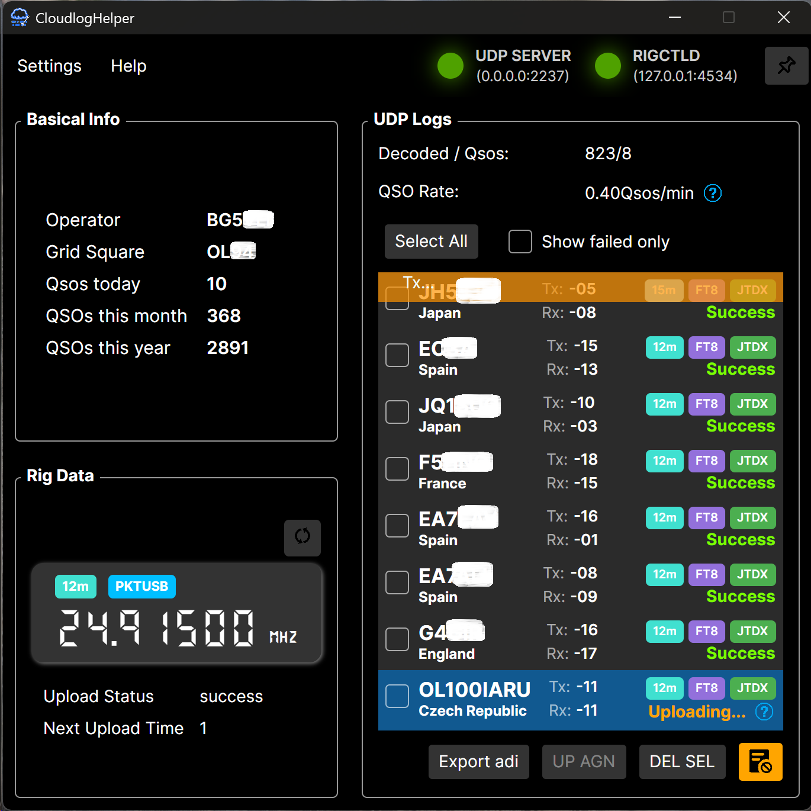
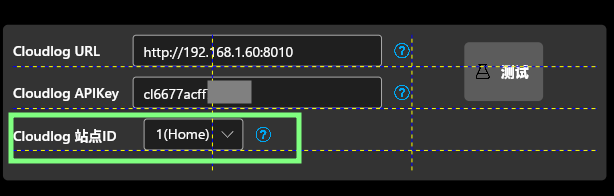
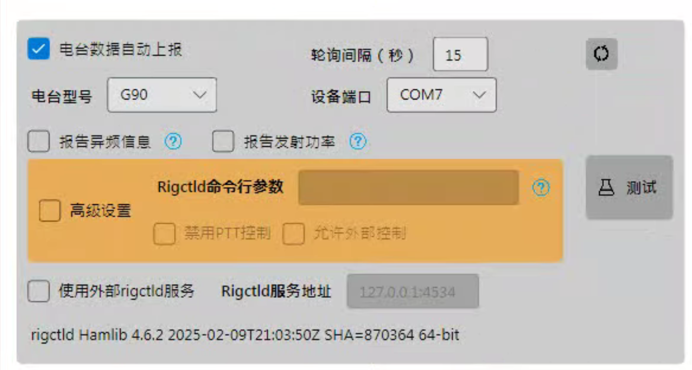
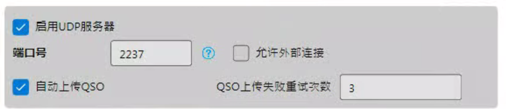
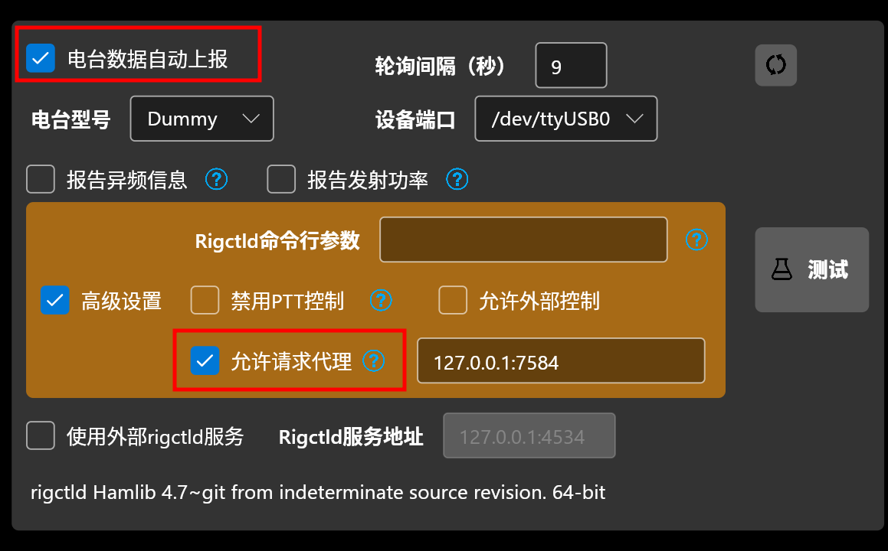
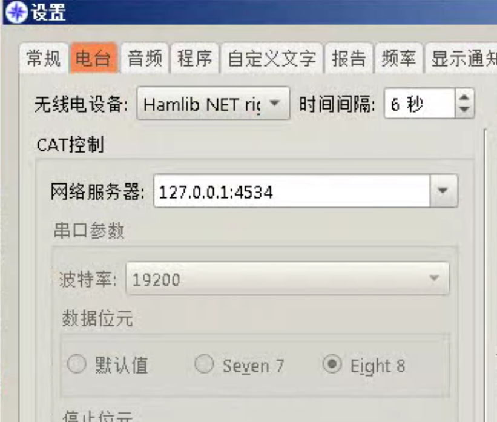

<div align="center">


# Cloudlog Helper


<br />

<br />


轻量级的`Cloudlog`/`Wavelog`辅助程序，自动上传当前电台信息以及实时QSO数据，支持大部分主流电台以及与`JTDX`/`WSJT-X`等软件协同工作！

如果您的电脑性能捉襟见肘，或单纯需要一个自动化QSO/电台信息上传工具，不妨来试试`Cloudlog Helper`！

  
</div>

## 💻 支持的平台

+ Windows 7 SP1+
+ Ubuntu 20.04+ 或其他主流发行版
+ 正在适配macOS...

## ⚡️ 快速开始!

> [!TIP]
> 您也可以选择自行编译，请参照下文的`编译`章节。
+ 从`Release`中下载对应系统版本的软件。如果您使用Linux且需要使用电台数据上报功能，请使用sudo启动软件。

+ 打开软件，点击`设置`->`基础设置`打开设置页面。

### 📌 Cloudlog配置

+ 输入您的Cloudlog / Wavelog服务器（下称Cloudlog）地址以及对应的API KEY。您可以按照下图所示的步骤获取URL和API KEY:

  

+ 点击“测试”，如您输入正确，在apikey下方将出现选择站点ID的下拉框。如果您在Cloudlog / Wavelog设置了多个站点请在此选择正确的id，后续的QSO都将上传到此id中。

  


### 📌 Hamlib配置

> [!NOTE]
>
> 如果您不需要电台数据自动上传功能，可直接忽略这一步。

> [!WARNING]
>
> 由于在开启JTDX（或WSJT-X，下称JTDX）后，电台的控制权将被JTDX独占，因此在未设置JTDX前，此功能和JTDX不能同时启用。可查看`与JTDX协同工作`部分获取解决方法。

本软件可以定时上传电台信息（频率、模式等）到您的Cloudlog服务器。当您需要记录QSO信息时，Cloudlog会自动获取当前的频率、模式等数据，并自动填充至对应输入框中，避免手动输入错误。同时， Cloudlog 主界面中也会实时显示电台的 频率、模式等信息，方便操作时参考。

+ 在`电台型号`下拉框中选择您使用的电台的型号。
+ 在`设备端口`中选择您的设备所在的端口。
+ 点击“测试”按钮。测试无误后方可勾选“电台数据自动上报”。点击“确认”保存配置。



+ 软件主界面应该出现了读取到的电台相关信息。打开您的Cloudlog网站，主页应该出现了您的电台信息：


+ 在"Station"中选择您的电台。此后，在您填写QSO信息时，Cloudlog都将自动帮您填充频率、模式等信息。


### 📌 UDP服务器配置

此部分的工作原理类似`GridTracker`，`JTDX`会通过 UDP 协议 广播当前解码的呼号、频率、信号报告等信息，而`CloudlogHelper`将接收这些信息并解码，将通联结果实时上传至您的Cloudlog服务器。

+ 此部分不须过多配置，如果您更改了此部分的端口号，请同步更改JTDX中的UDP服务器配置。**注意，如果JTDX和Cloudlog Helper不在同一台机器上运行，您需要勾选“允许外部连接”选项，并更改JTDX中UDP服务器的ip地址部分为运行Cloudlog Helper机器的ip。**



+ 此后，当JTDX处于发射模式，或完成了一个QSO之后，软件主界面都会显示对应信息。


## 🚀 高级
### 🎯 与JTDX协同工作
如果您希望在开启JTDX的情况下实时上报电台数据，请参考以下内容。

当您开启JTDX后，电台的控制权将被JTDX独占，此时您将无法通过本软件读取电台频率。
幸运的是，JTDX与CloudHelper一样均使用Hamlib作为电台的控制后端，同时JTDX支持从rigctld直接控制电台。
因此，我们可以开启一个rigctld实例，让CloudlogHelper和JTDX均能通过此实例控制电台并读取信息。
具体做法如下（以Windows7为例）：

+ 打开Cloudlog Helper，进入“设置”页面，填写电台相关信息后勾选“电台信息自动上报”。注意，**不要**勾选`禁用PTT控制`。JTDX依赖此功能控制电台发射。

  

+ 点击“应用更改”。

+ 打开`JTDX`，进入`设置`-`电台`，将`无线电设备`更改为`Hamlib NET rigctl`，CAT控制中的网络服务器填写`127.0.0.1:4534`，PTT方法保持原配置不变：

  

+ 测试CAT和PTT均可用后，点击“确定”。

+ 现在您就成功实现了CloudlogHelper和JTDX的协同工作。

  

> [!WARNING]  
> 注意，软件可能会提示“远程主机强迫关闭了连接”，或JTDX提示“无法与电台通信”，此为正常现象，JTDX的轮询请求可能与本软件同时发送造成rigctld处理不及时，可以将本软件的轮询间隔适当调长一些（10-30s）避免过多冲突，后续可能会进一步修正软件减小冲突概率。
## 🛠️ 编译

请首先确保编译环境已具备`.net 6.0`(或以上) 以及`gcc`。以下步骤仅适用于Linux x64环境，其他系统环境可参考`.github/workflows/build.yml`。

首先，克隆本仓库：
```shell
git clone --recursive --depth=1 https://github.com/SydneyOwl/cloudlog-helper.git
```

### 🔨 编译Hamlib

如果您完全不需要读取和上传电台信息，可以直接忽略这一步，软件可以在没有hamlib的情况下工作。

事实上我们只需要`rigctld`，它是`Hamlib`工具集中的一个无线电控制守护进程，允许通过TCP/IP网络远程控制无线电设备:
```shell
# 依赖安装
sudo apt install build-essential gcc g++ cmake make libusb-dev libudev-dev

cd cloudlog-helper/hamlib
./bootstrap

# 减小编译产物体积， 参考了wsjt-x的cmakelist
./configure --prefix=<INSTALL_DIR> --disable-shared --enable-static --without-cxx-binding \
CFLAGS="-g -O2 -fPIC -fdata-sections -ffunction-sections" \
LDFLAGS="-Wl,--gc-sections"

make -j4 all
make install-strip DESTDIR=""
```
编译完成后，您应该可以在`./<INSTALL_DIR>/bin`处找到编译产物`rigctld`。

### 🔨 编译软件本体

请执行以下命令:
```shell
cd cloudlog-helper
dotnet restore -r linux-x64
dotnet publish -c Release -r linux-x64 /p:PublishSingleFile=true --self-contained true
```
编译完成后，您应该可以在`bin/Release/net6.0/linux-64`找到编译的软件.把上文提到的`rigctld`(如有)复制到此文件夹中，即完成软件的编译。

## ✨ 其他
### 🐆 性能分析
此处简单模拟了一个远程挂机FT8的应用场景，在低端设备上测试，操作系统为64位的Windows 7 SP1, CPU为i5-3337u，内存8G。

系统上运行`Rustdesk` + `JTDX` + `Cloudlog helper` + `NetTime v3.14`。

挂机1小时后的CPU和内存占用如下，其中的CPU尖峰为某周期接收结束后的解码操作。


## 📝 许可证

`Cloudlog Helper`是释放至公共领域的免费无约束软件。任何人可出于任何目的（商业或非商业），以任何形式（源代码或编译文件），自由地复制、修改、发布、使用、编译、出售或分发本软件。

完整的许可证信息请参考仓库中的[Unlicense](./LICENSE)文件。
