# Cloudlog Helper [](https://deepwiki.com/SydneyOwl/cloudlog-helper)


Cloudlog Helper 是一款轻量级、跨平台、免安装的应用程序，可自动将实时电台数据和 QSO 信息同步到多个日志平台。它在为 Cloudlog 和 Wavelog 提供一流支持的同时，本身也是一款功能强大的独立日志记录工具！

+ 自动跨平台同步电台和 QSO 数据。
+ 支持 `Hamlib`/`FLRig`/`OmniRig` 进行电台控制，并能无缝配合 `JTDX`、`WSJT-X` 或其他兼容软件使用。
+ 包含丰富的图表和实用工具——极坐标信号图、距离分布图、全球热力图、QSO 比对助手等。
+ 免安装，开箱即用。
+ 原生支持 Windows / Linux / macOS。
+ 通过提供的 SDK（[Golang](https://github.com/SydneyOwl/clh-plugin-go-sdk) / [C#](https://github.com/SydneyOwl/clh-plugin-csharp-sdk)）支持软件控制。
+ 可轻松集成新的日志系统和自定义后端，支持将电台和解码后的 QSO 数据推送到用户自定义的 API。
+ 针对资源受限环境进行了优化——在低配硬件上也能稳定运行。

<p align="center">
  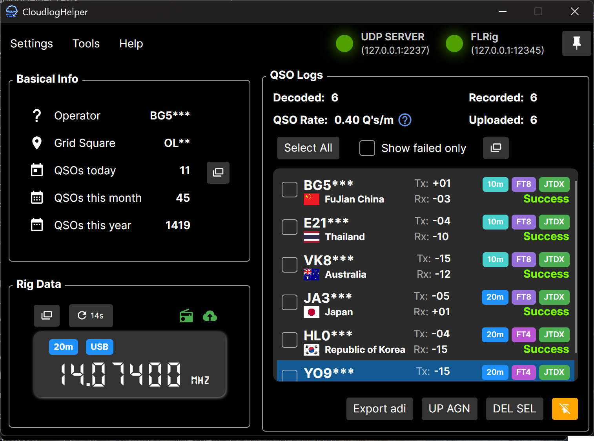
  <br />
  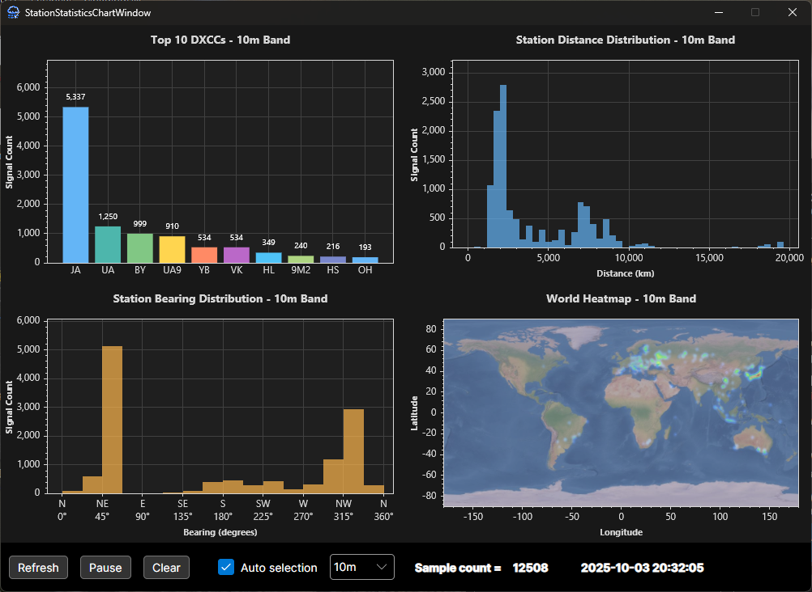
</p>

**（部分呼号已做匿名处理）**

**⚠️ 这是一个非官方的社区项目。未经 `Cloudlog`/`Wavelog` 开发团队认可，与其无直接关联，亦不由其维护或赞助。**


## 💻 支持平台

### 支持的操作系统
+ Windows 7 SP1+
+ Debian 9+ / Ubuntu 18.04+ / 其他发行版
+ macOS 10.14+

**注意：自 v0.4.0 起，出于实用性和可维护性考虑，主线已移除对 AOT 构建的支持，并不再提供 AOT 构建产物。**

## ⚡️ 快速开始！

> [!TIP]
> 你也可以选择自行编译。请参阅下方的`编译`部分。

+ 从 `Releases` 下载适用于你系统版本的软件。如果你使用的是 Linux，并且**需要使用 hamlib 后端进行电台数据上报**，可能需要使用 sudo 启动软件。

+ 打开软件，点击 `设置` -> `基本设置` 打开设置页面。

### 📌 基本设置

请在此处输入你的梅登海德定位器（4 字符）。

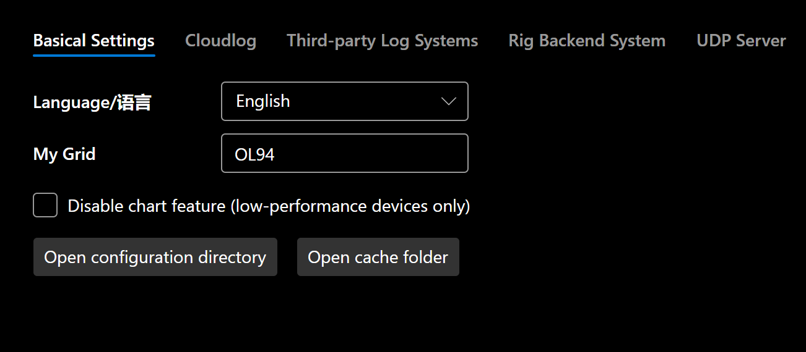

### 📌 Cloudlog/Wavelog 配置

输入你的 Cloudlog / Wavelog 服务器（以下简称 Cloudlog）地址和对应的 API KEY，然后点击“测试”。如果输入正确，API 密钥下方会出现一个用于选择电台 ID 的下拉框。如果你在 Cloudlog / Wavelog 中设置了多个电台，请在此选择正确的 ID。后续的 QSO 将上传到此 ID 下。

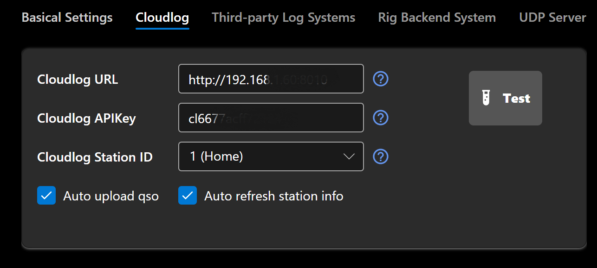

### 📌 第三方日志系统配置

> [!WARNING]
> 对于 **win7** 用户：ClubLog 的 API 似乎仅支持 TLS 1.2 及更高版本的协议。
> 因此，要使用 ClubLog 上传功能，你需要先安装补丁 [`KB3140245`](https://support.microsoft.com/en-us/topic/update-to-enable-tls-1-1-and-tls-1-2-as-default-secure-protocols-in-winhttp-in-windows-c4bd73d2-31d7-761e-0178-11268bb10392)
> 以在系统上启用 TLS 1.2 支持。
>
> 简而言之：从[此处](https://catalog.update.microsoft.com/search.aspx?q=kb3140245)安装 `KB3140245`，并从[此处](https://download.microsoft.com/download/0/6/5/0658B1A7-6D2E-474F-BC2C-D69E5B9E9A68/MicrosoftEasyFix51044.msi)安装 easyfix。


> [!NOTE]
>
> 你也可以添加自己的日志服务。详见下文。


本软件支持将日志上传到：

+ Cloudlog / Wavelog
+ Clublog
+ eqsl.cc
+ HamCQ
+ HRDLOG
+ LoTW
+ QRZ.com

在对应字段中输入你的呼号/密码或其他配置信息。

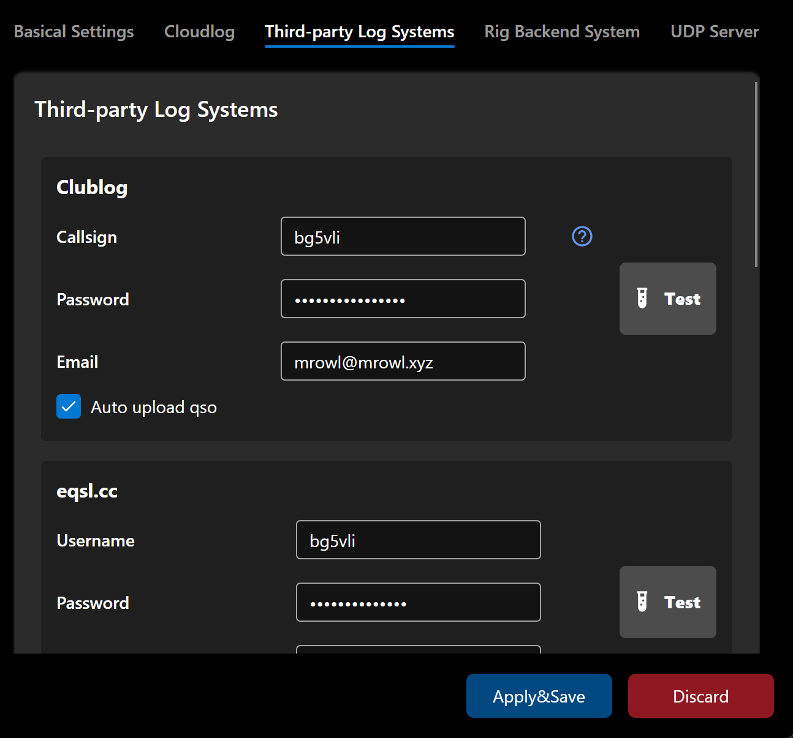

### 📌 电台配置

> [!NOTE]
>
> 如果你不需要自动上传电台数据的功能，可以直接跳过此步骤。

> [!WARNING]
>
> 多个电台后端不能同时启用。

本软件支持 `Hamlib` / `FLRig` / `OmniRig` 作为电台控制后端，可定时将电台信息（频率、模式等）上传到你的 Cloudlog 服务器、HRDLog 或其他指定后端。当你需要记录 QSO 信息时，Cloudlog 会自动获取当前频率、模式等数据，并自动填入对应的输入字段，避免手动录入错误。同时，Cloudlog 主界面也会实时显示电台的频率、模式等信息，供操作时参考。

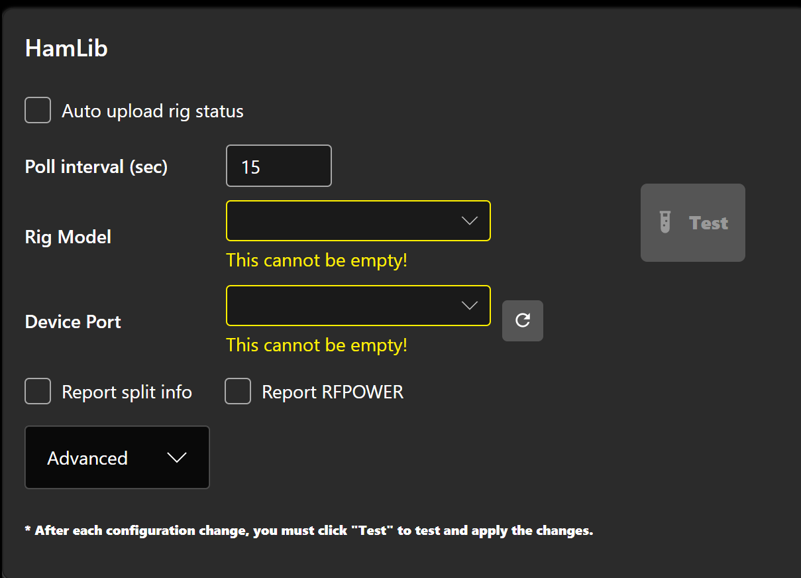

> [!WARNING]
>
> 如果你**使用 Hamlib 作为控制后端**，由于打开 JTDX（或 WSJT-X，以下简称 JTDX）会获取电台的独占控制权，因此在配置 JTDX 之前，本功能与 JTDX 不能同时启用。请查看`与 JTDX 协同工作`部分了解解决方案。

+ 对于 Hamlib，从`电台型号`下拉框中选择你的电台型号，并在`设备端口`字段中选择设备所在的端口。对于 FLRig，输入正确的 IP 地址和端口。

+ 点击“测试”按钮。测试成功后方可勾选“自动上报电台数据”。点击“确认”保存配置。

  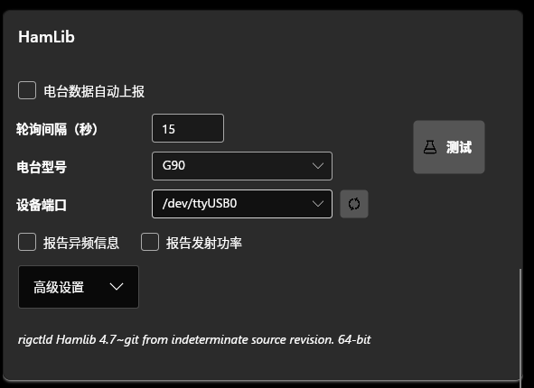

+ 此时软件主界面应显示获取到的电台信息。打开你的 Cloudlog 网站，首页应显示你的电台信息：

  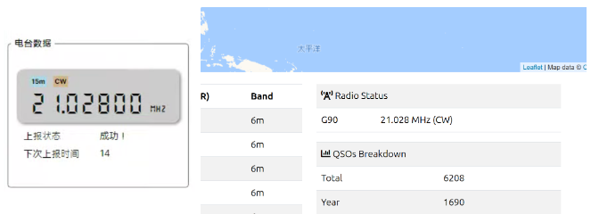

+ 在“电台”中选择你的电台。此后，当你填写 QSO 信息时，Cloudlog 会自动为你填充频率、模式等详细信息。

  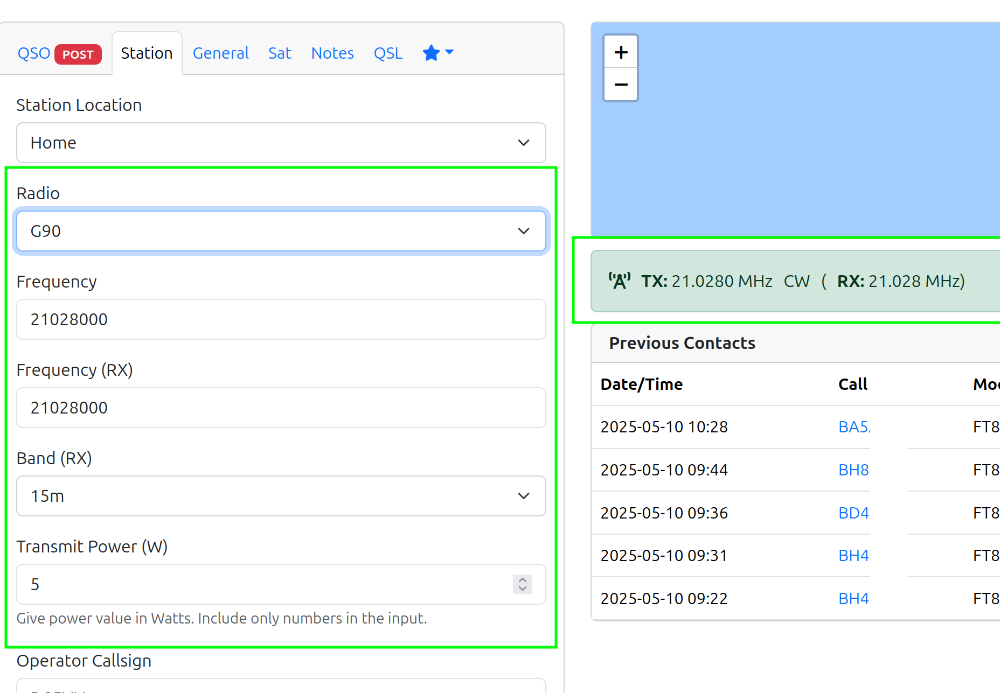

### 📌 UDP 服务器配置

此部分功能与 `GridTracker` 类似。`JTDX` 通过 UDP 协议广播当前解码的呼号、频率、信号报告等信息，`CloudlogHelper` 接收并解析这些信息，将通联结果实时上传到你的 Cloudlog 服务器。

+ 这部分不需要太多配置。如果你在此处更改了端口号，请同步更新 JTDX 中的 UDP 服务器配置。**注意：如果 JTDX 和 Cloudlog Helper 不在同一台机器上运行，你需要勾选“允许外部连接”选项，并将 JTDX 中 UDP 服务器的 IP 地址部分改为运行 Cloudlog Helper 的机器的 IP。**

  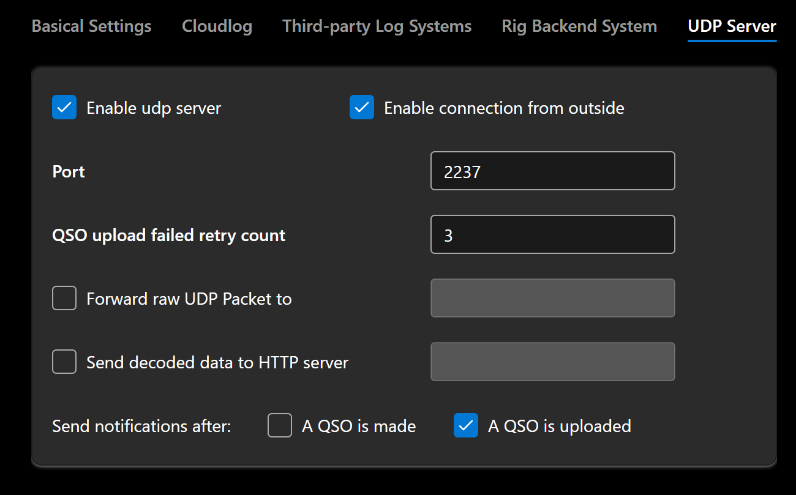

+ 此后，当 JTDX 处于发射模式或完成一次 QSO 时，软件主界面会显示相应的信息。

## 🚀 高级功能

### 📊 图表 - 信号分布极坐标图

此图表在极坐标系中展示接收信号的方位角和距离分布，其中**极坐标原点**对应你在设置中输入的**“我的梅登海德网格”**所对应的地理位置。

计算的距离为**大圆距离**，角度为**真北方位角**。信号点颜色越深表示该区域的通联密度越高。例如，下图清晰地显示大部分信号来自欧洲、日本和印度尼西亚。

当勾选“自动选择”并接收到 `wsjt-x` 或 `jtdx` 的状态信息时，图表将自动切换波段并显示符合条件的 QSO 分布。

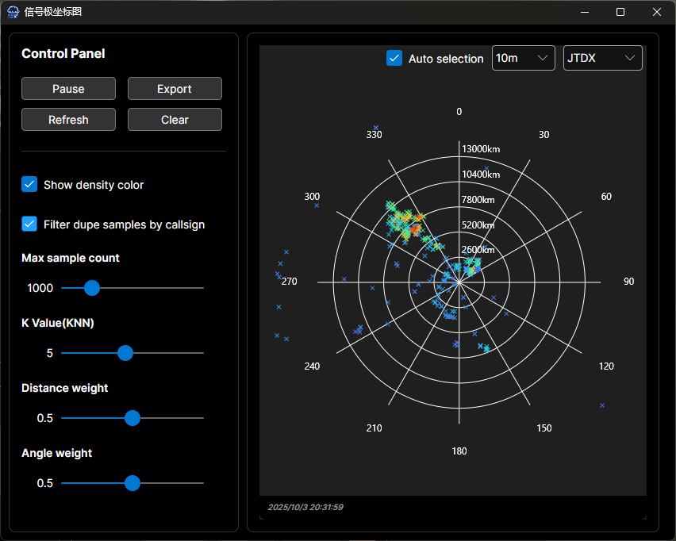

| 配置项 | 说明 |
|---------|------|
| 显示密度颜色 | 根据给定的 k 值、距离权重和角度权重，使用 KNN 算法计算每个信号点的密度估计值。根据所选颜色映射将密度值映射为对应的颜色，最终以热力图形式呈现在极坐标图上。此步骤计算量较大，当数据量过大或设备性能较差时可禁用。 |
| 过滤重复样本 | 按呼号去重。 |
| 最大样本点数 | 极坐标图上显示的信号点数量。建议 1000 以内，最大支持 8000。 |
| K 值 | K 近邻算法参数，影响密度计算精度。 |
| 距离权重 | 距离在密度计算中的权重。 |
| 角度权重 | 角度在密度计算中的权重。 |

### 📊 图表 - 电台统计数据

从左到右、从上到下，显示的图表依次为：

+ 解码 DXCC 前十名
+ 电台距离分布
+ 电台方位角分布
+ 全球热力图

同样，当勾选“自动选择”并接收到 `wsjt-x` 或 `jtdx` 的状态信息时，图表将自动切换波段并显示符合条件的 QSO 分布。


### 🔧 实用工具 - QSO 上传助手

此工具可从你的 Cloudlog 服务器自动下载已上传的 QSO，与本地 QSO（**目前仅支持 Wsjtx 和 JTDX 格式的日志**）进行比对，筛选出未上传的 QSO，并帮助你自动上传补全。例如，当你启动了 jtdx 但忘记启动日志软件，或网络意外断开而未被察觉时，可能会有漏传的 QSO。此工具旨在解决这一问题。

  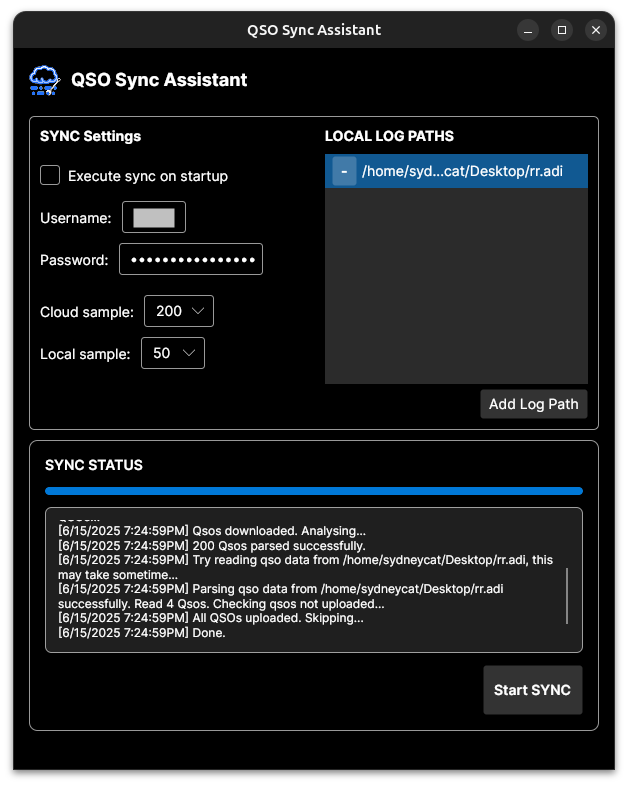

| 配置项 | 说明 |
|---------|------|
| 启动时执行同步 | 若勾选，每次软件启动时此工具将打开并自动开始同步。 |
| 用户名 | Cloudlog 登录用户名。 |
| 密码 | Cloudlog 密码。 |
| 云端样本（天） | 按天数从 Cloudlog 下载的最新 QSO 数量。这些 QSO 将作为与本地 QSO 比对的基准数据。<br/>请根据实际需求设置。如果通联不频繁，该值应适当增大，以确保下载的云端 QSO 样本量足以覆盖本地 QSO。**例如，设置为 `10` 表示工具将从云端获取最近 10 天的 QSO 记录。** |
| 本地样本（条） | 从本地日志文件中读取的近期 QSO 记录数量，用于与云端记录比对。例如，设置为 `50` 表示工具将检查最近 50 条本地 QSO 是否都已上传到云端（即是否都存在于从云端下载的最新 QSO 中，数量等于云端样本）。 |
| 本地日志路径 | 本地日志路径。 |

### 🎯 （仅 Hamlib）与 JTDX/WSJT-X 协同工作

如果希望在 JTDX 运行时同时实时上报电台数据，请参考以下内容。WSJT-X 的操作流程类似。

当 JTDX 运行时，它会独占电台的控制权，导致本软件无法读取电台频率。幸运的是，JTDX 和本软件都可以使用 Rigctld 作为电台控制后端。你只需修改 JTDX 中的网络服务器地址，使本软件和 JTDX 共用同一个 Rigctld 后端即可。

> [!IMPORTANT]
>
> 请勿将 JTDX 和本软件的轮询间隔设置得过短。过多的数据请求可能导致电台响应缓慢或出错。建议将 JTDX 设置 -> 电台中的时间间隔设为 8 秒，本软件的轮询间隔设为 15 秒。
> **请注意，间隔时间不应互为整数倍。** 这有助于防止两个程序同时轮询电台，避免造成过载。

具体步骤如下（以 Windows 7 为例）：

+ 打开 Cloudlog Helper，进入“设置”页面，填写电台信息，并勾选“自动上报电台数据”。注意：**不要**勾选`禁用 PTT 控制`。JTDX 依赖此功能来控制电台发射。

+ 点击“应用更改”。

+ 打开 `JTDX`，进入 `设置` -> `电台`，将`电台设备`改为 `Hamlib NET rigctl`。在 CAT 控制中，将网络服务器设置为 Rigctld 后端地址（默认为 127.0.0.1:4534）。PTT 方法配置保持不变。

  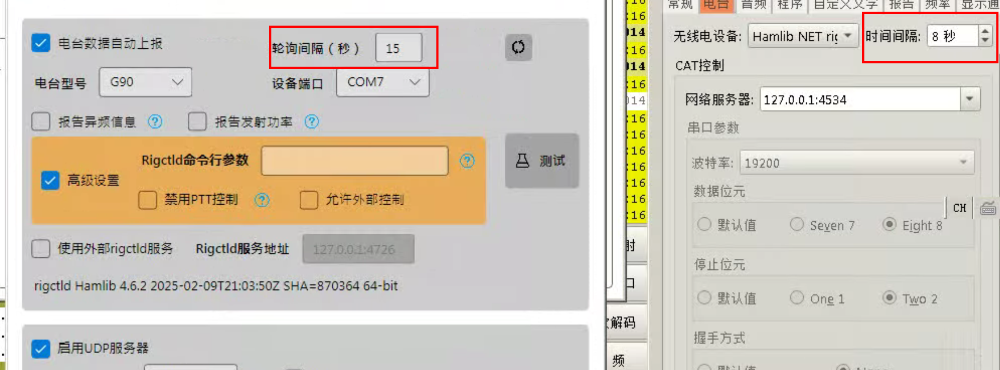

+ 测试 CAT 和 PTT 均正常后，点击“确定”。

+ 至此，你已成功启用 CloudlogHelper 与 JTDX 的协同工作。

  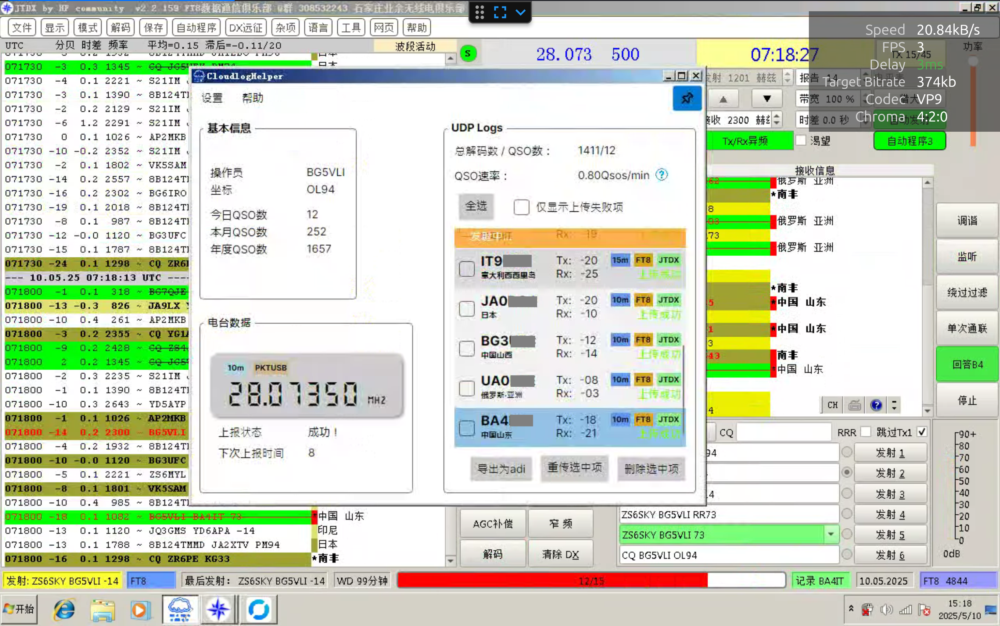

### 🎯 配置项说明

#### ⚙️ Hamlib 配置

| 配置项 | 说明 |
|--------|------|
| 自动上报电台数据 | 若勾选，软件将自动将获取到的电台信息上传到指定的 Cloudlog 服务器。 |
| 轮询间隔 | 指定查询 Rigctld 后端获取电台数据的时间间隔（秒）。默认为 9 秒。 |
| 电台型号 | 当前使用的电台型号。型号列表从 Rigctld 读取，因此理论上 Hamlib 支持的所有电台本软件均支持。 |
| 设备端口 | 电台连接的端口。 |
| 上报异频频率信息 | 轮询时向 Rigctld 请求异频频率信息（接收和发射使用不同频率）。**部分电台不支持此功能或可能返回错误数据。** |
| 上报发射功率 | 轮询时向 Rigctld 请求当前发射功率。**部分电台不支持此功能或可能返回错误数据。** |
| 高级 - Rigctld 命令行参数 | 手动指定启动 Rigctld 后端的命令行参数。此配置优先级最高。若此字段不为空，其他相关配置（禁用 PTT 控制 / 允许外部控制）将被忽略。**如果选择手动指定命令行参数，你必须显式指定 Rigctld 的 IP 地址和端口（`-T <ip> -t <port>`）。软件将从命令行参数中读取端口。** |
| 高级 - 禁用 PTT 控制 | 启动时禁用 RTS 和 DTR 控制（添加参数 `--set-conf="rts_state=OFF" --set-conf="dtr_state=OFF"`）。通常仅在部分 Linux 系统上需要。若与 JTDX 等第三方软件协同工作，不应勾选。 |
| 高级 - 允许外部控制 | 允许 localhost 以外的设备与本软件的 Rigctld 后端交互（添加参数 `-T 0.0.0.0`）。 |
| ~~高级 - 启用请求代理~~ | ~~启动一个代理服务器，可将外部请求转发到本软件，再由本软件按优先级自动发送给 Rigctld。~~（已弃用/移除） |
| 使用外部 Rigctld 服务 | 使用外部的 Rigctld 实例作为本软件的 Rigctld 后端。例如，如果你手动启动了 Rigctld 实例，可勾选此选项并配置本软件使用你指定的 Rigctld 后端。 |

#### ⚙️ UDP 服务器配置

| 配置项 | 说明 |
|--------|------|
| 启用 UDP 服务器 | 启动 UDP 服务器以接收第三方软件发送的 QSO 数据。 |
| 端口号 | UDP 服务器的端口号。 |
| 允许外部连接 | 允许接收 localhost 以外的设备发来的请求。 |
| QSO 上传重试次数 | 指定 QSO 上传失败时的重试次数。 |
| 转发 UDP 数据包 | 将接收到的 UDP 数据包转发到指定的 UDP 服务器，例如转发给 GridTracker。 |

#### ⚙️ 命令行参数

| 参数 | 说明 |
|------|------|
| `--verbose` | 输出 Trace 级别的日志。 |
| `--log2file` | 将日志记录到文件。路径为 `./log/xxxx`。 |
| `--reinit-db` | 重新初始化数据库。 |
| `--reinit-settings` | 重新初始化设置。 |
| `--reinit-hamlib` | 重新初始化 Hamlib 配置。 |
| `--dev` | 不启动崩溃日志收集窗口。 |
| `--udp-log-only` | 仅启用 UDP 日志上传功能，其他功能隐藏。 |
| `--crash-report` | 指定崩溃报告模块读取临时日志的目录。仅供内部使用。 |

#### ⚙️ 热键

| 按键 | 说明 |
|------|------|
| ⚠️ Ctrl（三击） | ⚠️ 在启动画面消失前快速按三下 Ctrl 键，可删除所有设置并重新初始化应用程序。 |

## 🛠️ 编译

### 🛠️ 在 Windows 上编译
你可以直接使用 CI 所用的脚本进行编译。

默认情况下，此脚本将为本软件支持的所有目标平台（win-x86、win-x64、linux-x64、linux-arm、linux-arm64）进行编译。
你可以通过指定命令行参数来只编译你需要的平台。

```powershell
powershell .\ci.ps1 -Platforms linux-x64,linux-arm64
```

编译完成后，你可以在 `src/CloudlogHelper/bin` 中找到编译好的软件。

### 🛠️ 在 Linux 上编译

> [!NOTE]
>
> Linux 不支持交叉编译到 Windows 专属框架（net8.0-windows10.0.17763.0）。

请确保你的编译环境已安装以下工具：
+ .net8
+ git
+ dotnet
+ curl
+ unzip
+ jq

首先克隆本仓库：

```shell
git clone --depth=1 https://github.com/SydneyOwl/cloudlog-helper.git
```

然后在仓库根目录下运行 `build.sh`。

```shell
bash ./build.sh
```

默认情况下，此脚本将为本软件支持的所有目标平台（win-x86、win-x64、linux-x64、linux-arm、linux-arm64）进行编译。
你可以通过指定命令行参数来只编译你需要的平台。

```shell
./build.sh --help
用法: ./build.sh [选项]
选项:
  -t, --tag <版本号>       应用程序构建版本号，默认为 dev-build
  -p, --platforms <列表>   目标平台（逗号分隔，如 win-x64,linux-x64）
                            可选值：win-x86、win-x64、linux-x64、linux-arm、linux-arm64
  -h, --help               显示此帮助信息
```

编译完成后，你可以在 `src/CloudlogHelper/bin` 中找到编译好的软件。

## ✨ 其他

### 🐧 Linux 内存修剪

在 Linux 上，Cloudlog Helper 会在关闭次要窗口后执行额外的原生内存修剪，以减少原生 UI/运行时分配导致的 RSS 增长。

如果此功能在你的发行版上引起兼容性问题，可在启动前禁用它：

```bash
DISABLE_MALLOC_TRIM_AFTER_WINDOW_CLOSED=1 ./CloudlogHelper
```

### ⬆️ 升级 Cloudlog Helper

+ v0.2.0 及更高版本：无需额外操作。直接下载最新版本的 Cloudlog Helper 并打开即可。
+ v0.1.5 及更早版本：若需保留之前的数据，请将软件生成的数据库文件（`cloudlog-helper.db`）和设置文件（`settings.json`）复制到新的配置目录（若不存在则创建）。Windows 下该目录为 `C:\Users\<用户名>\AppData\Local\CloudlogHelper`。Linux 下为 `/home/<用户名>/.config/CloudlogHelper`。由于版本变动较大，部分设置字段可能仍然缺失，请手动补全。

### 🗑️ 卸载 Cloudlog Helper

+ v0.2.0 及更高版本：删除 CloudlogHelper 可执行文件（自 v0.2.0 起为单文件），并删除目录 `C:\Users\<用户名>\AppData\Local\CloudlogHelper`（Windows）或 `/home/<用户名>/.config/CloudlogHelper`（Linux）。
+ v0.1.5 及更早版本：直接删除 Cloudlog Helper 文件夹即可。

### 🔍 集成其他日志系统

如果你需要将其他日志系统集成到本软件中，可参考 `LogService` 中的配置。
如果你有 C# 开发经验，应该能轻松添加新的配置。
（如果你愿意，请考虑提交 PR！）

CloudlogHelper 使用基于特性的系统来定义日志服务，开发者可以轻松添加新的服务。每个日志服务继承自 `ThirdPartyLogService` 并使用特定的特性进行配置。
程序会自动发现标记了 `LogServiceAttribute` 的类，UI 会自动为标记了 `UserInputAttribute` 的字段生成配置界面。简而言之，你只需：

+ 创建一个继承自 `ThirdPartyLogService` 的类，并使用 `[LogService("服务名称")]` 标记。
+ 为每个用户可配置的字段（如 API 密钥、用户名）添加属性，并使用 `[UserInput("显示名称")]` 标记。
+ 实现两个方法：一个用于测试与服务后端的连接，另一个用于将 QSO 数据上传到日志服务。你无需在这些方法内部处理潜在的异常。

### 📡 自定义后端支持

除了上报到 Cloudlog，你还可以将实时电台数据（频率、模式等）或 QSO ADIF 信息推送到你自己的服务器或 API，以便进行进一步开发。


在设置的“第三方日志系统”部分，你会找到“自定义 API”选项，在这里你可以输入自定义后端的端点。完成 QSO 或获取电台信息后，
应用程序会自动将相关数据推送到你提供的地址。请注意，输入的地址必须以 **http** 或 **https** 开头，例如 https://a.com/radio。
相关数据结构定义如下：

#### 电台信息

```json5
{
  "key": null,         // 保留字段，请忽略
  "radio": "G90",      // 电台名称
  "frequency": 14020000, // 发射频率（单位：Hz）
  "mode": "CW",        // 发射模式
  "frequencyRx": 14020000, // 接收频率（仅当启用“上报异频”时存在，否则为 null）
  "modeRx": "CW",      // 接收模式（仅当启用“上报异频”时存在，否则为 null）
  "power": 10.0        // 发射功率（仅当启用“上报功率”时存在，否则为 null）
}
```

#### ADIF 信息

```json5
{
  "adif": "<call:5>XXXXX <gridsquare:4>XXXX <mode:3>FT8 <rst_sent:3>-15 <rst_rcvd:3>-15 <qso_date:8>20260201 <time_on:6>080025 <qso_date_off:8>20260201 <time_off:6>080108 <band:3>20m <freq:9>14.075500 <station_callsign:6>XXXXXX <my_gridsquare:4>XXXX <eor>",
  "timestamp": 1769932856
}
```

你可以在 `Demo` 文件夹中找到示例。

### 🧩 插件

从 v0.3.2 开始，CLH 内置了插件系统，支持与第三方插件交互。你可以使用提供的 SDK 自由开发插件。

基本功能包括：

+ 查看当前 QSO 队列状态和详情（QueryQsoQueueSnapshot）。
+ 通过发送 ADIF 文本上传外部 QSO（CommandUploadExternalQSO / UploadExternalQsoAsync）。
+ 使用 qsoIds 触发特定 QSO 重新上传（多个 ID 用 ;;; 分隔）（CommandTriggerQsoReupload）。
+ 读取当前电台快照：后端、端点、频率、模式、异频、功率（QueryRigSnapshot）。
+ 读取当前 UDP 服务器快照：运行状态 + 绑定地址（QueryUdpSnapshot）。
+ 读取当前设置快照（QuerySettingsSnapshot）。
+ 一次性读取完整运行时快照（QueryRuntimeSnapshot）。
+ 读取服务器信息：版本、运行时间、保活超时、已连接的插件数量（QueryServerInfo）。
+ 读取已连接的插件列表及插件元数据/订阅信息（QueryConnectedPlugins）。
+ 读取插件遥测数据：收/发计数、控制错误、最近往返毫秒数（QueryPluginTelemetry）。
+ 控制 CLH UI：显示/隐藏主窗口，打开设置/关于/QSO 助手/电台统计数据/极坐标图窗口。
+ 控制服务：切换 UDP 服务器、切换电台后端轮询、切换电台后端（Hamlib、FLRig、OmniRig）。
+ 订阅事件：服务器状态、插件生命周期、WSJT-X 消息、实时解码、批量解码、电台数据、QSO 上传状态、QSO 队列状态、设置变更、插件遥测。

Golang SDK：[clh-plugin-go-sdk](https://github.com/SydneyOwl/clh-plugin-go-sdk)

C# SDK：[clh-plugin-csharp-sdk](https://github.com/SydneyOwl/clh-plugin-csharp-sdk)

## 🙏 致谢

+ [Hamlib](https://github.com/Hamlib/Hamlib)：业余无线电控制库（支持电台、旋转器、天调和放大器）（GPL、LGPL，可通过二进制文件调用）
+ [WsjtxUtils](https://github.com/KC3PIB/WsjtxUtils)：用于通过 UDP 与 WSJT-X 交互的 C# 类库和示例代码，基于 .NET 和 .NET Framework 4.8（MIT）
+ [ADIFLib](https://github.com/kv9y/ADIFLib)：用于读取、解析和写入 ADIF（版本 3.1.0）文件的 C# 库。（MIT）
+ [FT8CN](https://github.com/N0BOY/FT8CN)：在 Android 上运行 FT8。本软件的呼号归属解析逻辑及对应的 DXCC 中文翻译提取自此项目。（MIT）
+ [Cloudlog](https://github.com/magicbug/Cloudlog)：基于 Web 的业余无线电日志应用程序。本软件中的图标修改自此项目的图标。（MIT）
+ [GridTracker](https://gridtracker.org/)：GridTracker 是一个以易用界面呈现业余无线电信息的仓库。DXCC 实体映射到对应国家的逻辑源自此应用程序。
+ [country-flags](https://github.com/hampusborgos/country-flags)：此仓库包含所有国家旗帜的 SVG 和 PNG 格式精确渲染。

## 📝 许可证

`Cloudlog Helper` 是一款自由且无限制的软件，已发布到公共领域。
任何人均可自由复制、修改、发布、使用、编译、出售或分发本软件，
无论是源代码形式还是编译后的二进制形式，用于任何目的，商业或非商业。

完整的许可证信息请参阅仓库中的 [Unlicense](./LICENSE) 文件。

## ⚠️ 免责声明

1.  **软件使用**
    Cloudlog Helper 是免费开源软件，旨在为业余无线电爱好者提供便捷的 Cloudlog/Wavelog 辅助功能。用户可以自由下载、使用或修改本软件，但所有使用行为风险自负。开发者和贡献者不对因使用本软件造成的任何直接或间接损失负责，包括但不限于：
    + 数据丢失或损坏
    + 电台设备异常或故障
    + 网络通信问题
    + 因软件兼容性问题、配置错误或操作不当而产生的其他后果

2.  **功能限制**
    + 测试阶段声明：本软件目前处于测试阶段（UNDER TESTING），可能包含未发现的缺陷或功能不稳定性。建议用户在使用前备份重要数据，并避免完全依赖本软件进行关键操作。
    + 第三方依赖：本软件依赖于第三方库或工具，如 Hamlib、JTDX/WSJT-X 等，其功能和兼容性受限于这些组件的支持范围。开发者无法保证适配所有设备或软件。

3.  **数据安全与隐私**
    + 用户有责任确保输入的敏感数据的安全，如 Cloudlog/Wavelog API Key、Clublog 账户信息等。本软件不会主动收集或存储这些信息，但用户自身设备或网络环境导致的数据泄露风险需由用户自行承担。
    + 通过 UDP 服务器接收的 QSO 数据默认在本地处理。启用“允许外部连接”功能可能增加安全风险，请谨慎配置。

4.  **设备操作风险**
    + 使用 Hamlib 控制电台时，请确保遵循设备制造商的操作规范。错误的轮询间隔或配置可能导致电台异常。建议初次使用时先在不连接电台的情况下测试功能。
    + 与 JTDX/WSJT-X 等软件协同时，注意避免端口冲突或控制争用问题。开发者不对因配置错误导致的设备损坏负责。