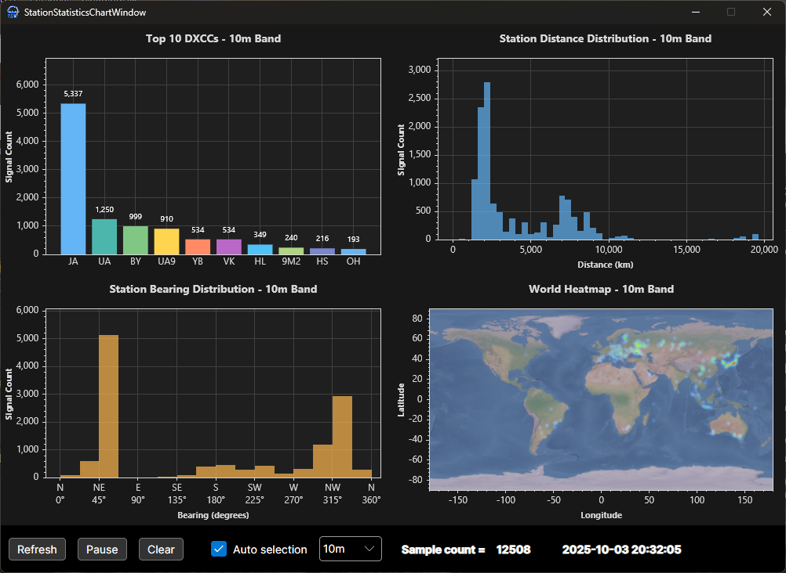
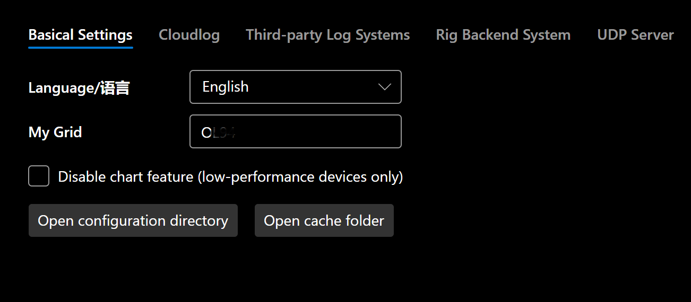
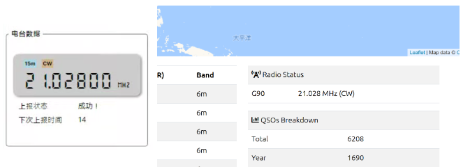
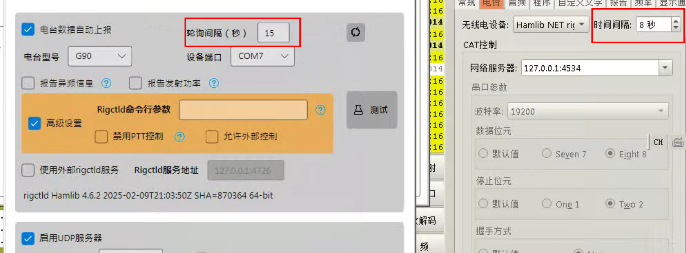

# Cloudlog 助手 [](https://deepwiki.com/SydneyOwl/cloudlog-helper)


Cloudlog 助手是一款轻量级、跨平台、便携式的应用程序，能够自动将实时电台数据和 QSO 信息同步到多个日志平台。
本软件不仅为 Cloudlog 和 Wavelog 提供一流的原生支持，同时也是一个功能强大、完全可以独立使用的日志记录工具！

+ 自动在多个平台间同步电台和 QSO 数据（支持 Clublog/eqsl/HRDLOG/LoTW/QRZ/...）
+ 支持 `Hamlib`/`FLRig`/`OmniRig` 作为电台控制后端，可与 `JTDX`、`WSJT-X` 等兼容软件无缝协同工作
+ 内置丰富图表和实用工具——极坐标信号分布图、距离分布图、全球热力图、QSO 比对助手等
+ 绿色便携、无需安装——开箱即用
+ 原生支持 Windows 和 Linux，macOS 版本正在开发中
+ 易于集成新的日志系统和自定义后端，支持将电台数据和已解码的 QSO 数据推送至用户自定义 API
+ 针对资源受限环境优化——即使在低端硬件上也能稳定运行

<p align="center">
  
  <br />
  
</p>

**（部分呼号已作匿名化处理）**

**⚠️ 本项目为社区驱动的非官方工具，未经 `Cloudlog`/`Wavelog` 官方开发团队认可、直接关联、维护或赞助。**

## 💻 支持平台

+ Windows 7 SP1 及以上
+ Debian 9+ / Ubuntu 18.04+ / 其他发行版（需 glibc ≥ 2.24）
+ macOS 支持开发中...

## ⚡️ 快速开始！

> [!TIP]
> 你也可以选择自行编译，请参考下方「编译」章节。

+ 从 `Releases` 页面下载对应系统版本的软件。若使用 Linux 系统且**需要使用 hamlib 后端上报电台数据**，请以 sudo 权限启动软件。

+ 打开软件，点击 `设置` -> `基础设置` 进入设置页面。

### 📌 基础设置

请在此处输入你的梅登黑德网格定位码（4 字符）。



### 📌 Cloudlog/Wavelog 配置

输入 Cloudlog / Wavelog 服务器地址（以下简称 Cloudlog）及相应的 API KEY，点击“测试”。若输入正确，API 密钥下方将出现选择站台 ID 的下拉框。若你在 Cloudlog / Wavelog 中设置了多个站台，请在此选择正确的 ID，后续 QSO 将上传至该站台。


### 📌 第三方日志系统配置

> [!WARNING]
> **Win7 用户请注意**：ClubLog 的 API 似乎仅支持 TLS 1.2 及以上协议。
> 因此，要使用 ClubLog 上传功能，需先安装补丁 [`KB3140245`](https://support.microsoft.com/en-us/topic/update-to-enable-tls-1-1-and-tls-1-2-as-default-secure-protocols-in-winhttp-in-windows-c4bd73d2-31d7-761e-0178-11268bb10392)
> 以在系统中启用 TLS 1.2 支持。
>
> 简而言之：请从[此处](https://catalog.update.microsoft.com/search.aspx?q=kb3140245)安装 `KB3140245` 并从[此处](https://download.microsoft.com/download/0/6/5/0658B1A7-6D2E-474F-BC2C-D69E5B9E9A68/MicrosoftEasyFix51044.msi)安装 easyfix。

> [!NOTE]
>
> 你还可以添加自己的日志服务，详情见下文。

本软件支持将日志上传至：

+ Cloudlog / Wavelog
+ Clublog
+ eqsl.cc
+ HamCQ
+ HRDLOG
+ LoTW
+ QRZ.com

请在对应字段输入你的呼号/密码或其他配置信息。


### 📌 电台配置

> [!NOTE]
>
> 若无需自动上报电台数据功能，可直接跳过此步骤。

> [!WARNING]
>
> 多个电台后端不能同时启用。

本软件支持以 `Hamlib` / `FLRig` / `OmniRig` 作为电台控制后端，可定时将电台信息（频率、模式等）上传至你的 Cloudlog 服务器、HRDLog 或其他指定后端。当你需要记录 QSO 信息时，Cloudlog 将自动获取当前频率、模式等数据，并填充对应输入框，避免手动输入错误。同时，Cloudlog 主界面也会实时显示电台频率、模式等信息，供操作时参考。


> [!WARNING]
>
> 若**使用 Hamlib 作为控制后端**，由于 JTDX（或 WSJT-X，下称 JTDX）运行时会独占电台控制权，在配置 JTDX 前此功能与 JTDX 无法同时启用。请查看「与 JTDX 协同工作」章节了解解决方案。

+ 对于 Hamlib：从 `电台型号` 下拉框选择你的电台型号，并在 `设备端口` 选择设备所在端口。对于 FLRig：输入正确的 IP 地址和端口。

+ 点击“测试”按钮。仅测试成功后，方可勾选“自动上报电台数据”。点击“确认”保存配置。

  

+ 此时软件主界面应显示获取到的电台信息。打开你的 Cloudlog 网站，首页应显示电台信息：

  

+ 在 Cloudlog 的“站台”中选择你的电台。此后，填写 QSO 信息时，Cloudlog 将自动为你填充频率、模式等详情。

  

### 📌 UDP 服务器配置

此部分功能类似 `GridTracker`。`JTDX` 通过 UDP 协议广播当前解码到的呼号、频率、信号报告等信息，`CloudlogHelper` 接收并解码这些信息，实时将通联结果上传至你的 Cloudlog 服务器。

+ 此部分无需过多配置。若在此更改端口号，请同步更新 JTDX 中的 UDP 服务器配置。**注意：若 JTDX 与 Cloudlog Helper 不在同一台机器上运行，需勾选“允许外部连接”选项，并将 JTDX 中 UDP 服务器的 IP 地址部分改为运行 Cloudlog Helper 的机器 IP。**

  

+ 此后，当 JTDX 处于发射模式或完成一次 QSO 时，软件主界面将显示相应信息。

## 🚀 高级功能

### 📊 图表 - 极坐标信号分布图

此图表在极坐标系中显示接收信号的方位角和距离分布，其中**极坐标系原点**对应你在设置中输入的 **“我的梅登黑德网格”** 的地理位置。

计算的距离为**大圆距离**，角度为**真北方位角**。颜色越深的信号点表示该区域通信密度越高。例如，下图清晰显示大部分信号来自欧洲、日本和印度尼西亚。

勾选“自动选择”并收到 `wsjt-x` 或 `jtdx` 的状态信息时，图表将自动切换频段，显示符合条件的 QSO 分布。


| 配置项 | 说明 |
|--------|------|
| 显示密度颜色 | 基于给定的 k 值、距离权重和角度权重，使用 KNN 算法计算每个信号点的密度估计值，根据所选色彩映射将密度值映射为对应颜色，最终在极坐标图上以热力图形式呈现。此步骤计算量较大，数据量过多或设备性能不足时可关闭。 |
| 过滤重复样本 | 按呼号去重。 |
| 最大样本点数 | 极坐标图上显示的信号点数量。建议 1000 以内，最高支持 8000。 |
| K 值 | K 最近邻算法参数，影响密度计算精度。 |
| 距离权重 | 密度计算中距离的权重。 |
| 角度权重 | 密度计算中角度的权重。 |

### 📊 图表 - 站台统计

从左至右、从上至下，显示的图表依次为：

+ 解码最多的前 10 个 DXCC
+ 站台距离分布
+ 站台方位角分布
+ 全球热力图

同样，勾选“自动选择”并收到 `wsjt-x` 或 `jtdx` 的状态信息时，图表将自动切换频段，显示符合条件的 QSO 分布。


### 🔧 实用工具 - QSO 上传助手

此工具可自动从你的 Cloudlog 服务器下载已上传的 QSO，与本地 QSO（**目前仅支持 Wsjtx 和 JTDX 格式日志**）进行比对，筛选出未上传的 QSO，并帮助你自动补传。例如，若你启动了 jtdx 却忘记开启日志软件，或网络意外断开未被察觉，可能导致有 QSO 漏传。本工具旨在解决此问题。

  

| 配置项 | 说明 |
|--------|------|
| 启动时执行同步 | 若勾选，每次软件启动时，此工具将自动开启并开始同步。 |
| 用户名 | Cloudlog 登录用户名。 |
| 密码 | Cloudlog 密码。 |
| 云端样本（天） | 从 Cloudlog 下载最近多少天的 QSO 作为基准数据，与本地 QSO 进行比对。<br/>请根据需求设置。若通信不频繁，此值应适当增大，以确保下载的云端 QSO 样本量足以覆盖本地 QSO。**例如，设为 `10` 表示工具将获取云端最近 10 天的 QSO 记录。** |
| 本地样本（QSO 数量） | 从本地日志文件中读取最近多少条 QSO 记录与云端记录比对。例如，设为 `50` 表示工具将检查最近 50 个本地 QSO 是否已全部上传至云端（即是否全部存在于从云端下载的最近 QSO 中，数量等于云端样本天数对应的记录数）。 |
| 本地日志路径 | 本地日志文件路径。 |

### 🎯 （仅 Hamlib）与 JTDX/WSJT-X 协同工作

若希望在 JTDX 运行的同时实时上报电台数据，请参考以下步骤。WSJT-X 的操作类似。

JTDX 运行时会对电台进行独占控制，导致本软件无法读取电台频率。幸运的是，JTDX 和本软件均可使用 Rigctld 作为电台控制后端。你只需修改 JTDX 中的网络服务器地址，使本软件和 JTDX 共享同一个 Rigctld 后端即可。

> [!IMPORTANT]
>
> 请勿将 JTDX 和本软件的轮询间隔设置过短。过多的数据请求可能导致电台响应缓慢或报错。建议将 JTDX 设置 -> 电台中的时间间隔设为 8 秒，本软件的轮询间隔设为 15 秒。
> **请注意，间隔时间不应互为整数倍**。这有助于避免两个程序同时轮询电台造成过载。

具体步骤如下（以 Windows 7 为例）：

+ 打开 Cloudlog Helper，进入“设置”页面，填写电台信息，并勾选“自动上报电台数据”。注意：**不要**勾选 `禁用 PTT 控制`。JTDX 依赖此功能控制电台发射。

+ 点击“应用更改”。

+ 打开 `JTDX`，进入 `设置` -> `电台`，将 `电台设备` 改为 `Hamlib NET rigctl`。在 CAT 控制中，将网络服务器设置为 Rigctld 后端地址（默认为 127.0.0.1:4534）。PTT 方法配置保持不变。

  

+ 测试 CAT 和 PTT 功能均正常后，点击“确定”。

+ 至此，你已成功启用 CloudlogHelper 与 JTDX 的协同工作。

  

### 🎯 配置项说明

#### ⚙️ Hamlib 配置

| 配置项 | 说明 |
|--------|------|
| 自动上报电台数据 | 若勾选，软件将自动把获取的电台信息上传至指定的 Cloudlog 服务器。 |
| 轮询间隔 | 指定查询 Rigctld 后端电台数据的时间间隔（秒）。默认为 9 秒。 |
| 电台型号 | 当前使用的电台型号。型号列表从 Rigctld 读取，因此理论上 Hamlib 支持的电台本软件均支持。 |
| 设备端口 | 电台连接的端口。 |
| 上报异频频率信息 | 轮询时向 Rigctld 请求异频频率信息（收发使用不同频率）。**部分电台不支持此功能或可能返回错误数据。** |
| 上报发射功率 | 轮询时向 Rigctld 请求当前发射功率。**部分电台不支持此功能或可能返回错误数据。** |
| 高级 - Rigctld 命令行参数 | 手动指定启动 Rigctld 后端的命令行参数。此设置优先级最高。若此字段非空，其他相关配置（禁用 PTT 控制 / 允许外部控制）将被忽略。**若选择手动指定命令行参数，必须明确指定 Rigctld IP 地址和端口（`-T <ip> -t <port>`）。软件将从命令行参数中读取端口。** |
| 高级 - 禁用 PTT 控制 | 启动时禁用 RTS 和 DTR 控制（添加参数 `--set-conf="rts_state=OFF" --set-conf="dtr_state=OFF"`）。通常仅在某些 Linux 系统中需要。若与 JTDX 等第三方软件协同工作，不应勾选此项。 |
| 高级 - 允许外部控制 | 允许来自 localhost 以外设备的 Rigctld 后端交互（添加参数 `-T 0.0.0.0`）。 |
| ~~高级 - 启用请求代理~~ | ~~启动代理服务器，可将外部请求转发至软件内部，软件根据优先级自动将其发送至 Rigctld。~~（已弃用/移除） |
| 使用外部 Rigctld 服务 | 使用外部 Rigctld 实例作为软件的 Rigctld 后端。例如，若你手动启动了 Rigctld 实例，勾选此选项并配置软件使用你指定的 Rigctld 后端。 |

#### ⚙️ UDP 服务器配置

| 配置项 | 说明 |
|--------|------|
| 启用 UDP 服务器 | 启动 UDP 服务器以接收来自第三方软件的 QSO 数据。 |
| 端口号 | UDP 服务器的端口号。 |
| 允许外部连接 | 允许接收来自 localhost 以外设备的请求。 |
| QSO 上传重试次数 | 指定失败 QSO 上传的重试次数。 |
| 转发 UDP 数据包 | 将接收到的 UDP 数据包转发至指定的 UDP 服务器，例如转发至 GridTracker。 |

#### ⚙️ 命令行参数

| 参数 | 说明 |
|------|------|
| `--verbose` | 打印 Trace 级别日志。 |
| `--log2file` | 将日志记录至文件。路径为 `./log/xxxx`。 |
| `--reinit-db` | 重新初始化数据库。 |
| `--reinit-settings` | 重新初始化设置。 |
| `--reinit-hamlib` | 重新初始化 Hamlib 配置。 |
| `--dev` | 不启动崩溃日志收集窗口。 |
| `--udp-log-only` | 仅启用 UDP 日志上传功能；其他功能隐藏。 |
| `--crash-report` | 指定崩溃报告模块读取临时日志的目录。仅内部使用。 |

#### ⚙️ 快捷键

| 按键 | 说明 |
|------|------|
| ⚠️ Ctrl（快速三击） | ⚠️ 在启动画面消失前快速连按三次 Ctrl 键，将删除所有设置并重新初始化应用。 |

## 🛠️ 编译

### 🛠️ 在 Windows 上编译
你可以直接使用为 CI 准备的脚本进行编译。
默认情况下，此脚本将编译本软件支持的所有目标平台（win-x86, win-x64, linux-x64, linux-arm, linux-arm64）。
你也可以通过命令行参数指定仅编译所需平台。

```powershell
powershell .\ci.ps1 -Platforms linux-x64,linux-arm64
```

编译完成后，可在 `src/CloudlogHelper/bin` 目录下找到编译好的软件。

### 🛠️ 在 Linux 上编译

> [!NOTE]
>
> Linux 不支持交叉编译到 Windows 特定框架（net6.0-windows10.0.17763.0）。
> 脚本将使用备用框架（net6.0）进行编译。编译产物将不支持系统原生通知和 OmniRig。

请确保你的构建环境已安装以下工具：
+ .net6
+ git
+ dotnet
+ curl
+ unzip
+ jq

首先，克隆此仓库：

```shell
git clone --depth=1 https://github.com/SydneyOwl/cloudlog-helper.git
```

然后在此仓库根目录运行 `build.sh`。

```shell
bash ./build.sh
```

默认情况下，此脚本将编译本软件支持的所有目标平台（win-x86, win-x64, linux-x64, linux-arm, linux-arm64）。
你可以通过命令行参数指定仅编译所需平台。

```shell
./build.sh --help
Usage: ./build.sh [options]
Options:
  -t, --tag <version>       应用程序构建版本号，默认为 dev-build
  -p, --platforms <list>    目标平台（逗号分隔，例如 win-x64,linux-x64）
                            可选范围：win-x86,win-x64,linux-x64,linux-arm,linux-arm64
  -h, --help                显示此帮助信息
```

编译完成后，可在 `src/CloudlogHelper/bin` 目录下找到编译好的软件。

## ✨ 其他事项

### ⬆️ 升级 Cloudlog Helper

+ v0.2.0 及以后版本：无需额外步骤，直接下载最新版 Cloudlog Helper 并打开即可。
+ v0.1.5 及以前版本：如需保留先前数据，请将软件生成的数据库文件（`cloudlog-helper.db`）和设置文件（`settings.json`）复制到新的配置目录（若不存在则创建）。Windows 目录为 `C:\Users\<用户名>\AppData\Local\CloudlogHelper`，Linux 目录为 `/home/<用户名>/.config/CloudlogHelper`。由于版本变动较大，部分设置字段可能仍缺失，请手动补全。

### 🗑️ 卸载 Cloudlog Helper

+ v0.2.0 及以后版本：删除 CloudlogHelper 可执行文件（自 v0.2.0 起为单文件），并删除目录 `C:\Users\<用户名>\AppData\Local\CloudlogHelper`（Windows）或 `/home/<用户名>/.config/CloudlogHelper`（Linux）。
+ v0.1.5 及以前版本：直接删除 Cloudlog Helper 文件夹即可。

### 🔍 集成其他日志系统

如需将其他日志系统集成到软件中，请参考 `LogService` 中的配置。
若你具备 C# 开发经验，应能轻松添加新配置。
（考虑提交 PR 哦！）

CloudlogHelper 使用基于属性的系统定义日志服务，使开发者能够轻松添加新的服务。每个日志服务继承自 `ThirdPartyLogService`，并使用特定属性进行配置。
程序会自动发现标有 `LogServiceAttribute` 的类，UI 会自动为标有 `UserInputAttribute` 的字段生成配置界面。简而言之，你只需要：

+ 创建一个继承自 `ThirdPartyLogService` 的类，并用 `[LogService("服务名称")]` 标记。
+ 为每个用户可配置字段（如 API 密钥、用户名）添加属性，并用 `[UserInput("显示名称")]` 标记。
+ 实现两个方法：一个用于测试与服务后端的连接，另一个用于将 QSO 数据上传至日志服务。无需在这些方法内部处理潜在异常。
+ 在 ThirdPartyLogService 上添加属性 `[JsonDerivedType(typeof(你的服务类), nameof(你的服务类))]`，以确保日志服务设置能在 AOT 环境中被正确识别和持久化。

### 📡 自定义后端支持

除了上报至 Cloudlog，你还可以将实时电台数据（频率、模式等）或 QSO 的 ADIF 信息推送到你自己的服务器或 API，实现进一步的开发。


在设置的“第三方日志系统”部分，你将找到“自定义 API”选项，可在此输入自定义后端端点。完成 QSO 或获取电台信息后，应用程序会自动将相关数据推送到你提供的地址。请注意，输入的地址必须以 **http** 或 **https** 开头，例如 https://a.com/radio。
相关数据结构定义如下：

#### 电台信息（POST，json）

```json5
{
  "key": null,         // 保留字段，请忽略
  "radio": "G90",      // 电台名称
  "frequency": 14020000, // 发射频率（Hz）
  "mode": "CW",        // 发射模式
  "frequencyRx": 14020000, // 接收频率（仅当启用“上报异频”时有效，否则为 null）
  "modeRx": "CW",      // 接收模式（仅当启用“上报异频”时有效，否则为 null）
  "power": 10.0        // 发射功率（仅当启用“上报功率”时有效，否则为 null）
}
```

#### ADIF 信息（POST，json）

```json5
{
  "adif": "<call:5>XXXXX <gridsquare:4>XXXX <mode:3>FT8 <rst_sent:3>-15 <rst_rcvd:3>-15 <qso_date:8>20260201 <time_on:6>080025 <qso_date_off:8>20260201 <time_off:6>080108 <band:3>20m <freq:9>14.075500 <station_callsign:6>XXXXXX <my_gridsquare:4>XXXX <eor>",
  "timestamp": 1769932856
}
```

**收到数据后，你的服务器应返回字符串 "OK"；否则软件将认为数据推送失败并通知用户。**

你可以在 `Demo` 文件夹中找到示例代码。

## 🙏 致谢

+ [Hamlib](https://github.com/Hamlib/Hamlib)：业余无线电控制库（支持电台、旋转器、调谐器、放大器）（GPL, LGPL，可通过二进制文件调用）
+ [WsjtxUtils](https://github.com/KC3PIB/WsjtxUtils)：使用 .NET 和 .NET Framework 4.8 通过 UDP 与 WSJT-X 交互的 C# 类库和示例代码（MIT）
+ [ADIFLib](https://github.com/kv9y/ADIFLib)：用于读取、解析和写入 ADIF（版本 3.1.0）文件的 C# 库（MIT）
+ [FT8CN](https://github.com/N0BOY/FT8CN)：在 Android 上运行 FT8。本软件的呼号归属解析逻辑及相应 DXCC 中文翻译均提取自此项目（MIT）
+ [Cloudlog](https://github.com/magicbug/Cloudlog)：基于 Web 的业余无线电日志应用程序。本软件的图标修改自该项目的图标（MIT）
+ [GridTracker](https://gridtracker.org/)：GridTracker 是一个以易用界面呈现业余无线电信息的仓库。DXCC 实体与国家/地区的映射逻辑来源于此应用程序。
+ [country-flags](https://github.com/hampusborgos/country-flags)：此仓库包含所有国家/地区旗帜的精确 SVG 和 PNG 格式渲染。

## 📝 许可证

`Cloudlog Helper` 是自由的、不受限制的公有领域软件。
任何人都可以自由复制、修改、发布、使用、编译、出售或分发此软件，
无论是源代码形式还是编译后的二进制形式，用于任何商业或非商业目的。

完整许可证信息，请参见仓库中的 [Unlicense](./LICENSE) 文件。

## ⚠️ 免责声明

1.  **软件使用**
    
    Cloudlog Helper 是免费开源软件，旨在为业余无线电爱好者提供便捷的辅助功能。用户可自由下载、使用或修改本软件，但一切使用风险自负。开发者和贡献者不对使用本软件造成的任何直接或间接损失负责，包括但不限于：
    + 数据丢失或损坏
    + 无线电设备异常或故障
    + 网络通信问题
    + 因软件兼容性问题、配置错误或操作不当引发的其他后果。

2.  **功能限制**
    + 测试阶段声明：本软件目前处于测试阶段，可能存在未发现的缺陷或功能不稳定性。建议用户在使用前备份重要数据，避免完全依赖本软件进行关键操作。
    + 第三方依赖：本软件依赖 Hamlib、JTDX/WSJT-X 等第三方库或工具，其功能和兼容性受限于这些组件的支持范围。开发者无法保证适配所有设备或软件。

3.  **数据安全与隐私**
    + 用户需自行确保所输入的敏感数据（如 Cloudlog/Wavelog API Key、Clublog 账户信息等）的安全。本软件不会主动收集或存储此类信息，但因用户设备或网络环境导致的数据泄露风险需由用户自行承担。
    + 通过 UDP 服务器接收的 QSO 数据默认在本地处理。开启“允许外部连接”功能可能增加安全风险，请谨慎配置。

4.  **设备操作风险**
    + 使用 Hamlib 控制电台时，请确保遵循设备制造商的操作规范。不正确的轮询间隔或配置可能导致电台异常。建议初次使用时在不连接电台的情况下测试功能。
    + 与 JTDX/WSJT-X 等软件协同工作时，注意避免端口冲突或控制权争夺问题。因配置错误导致的设备损坏，开发者不承担责任。