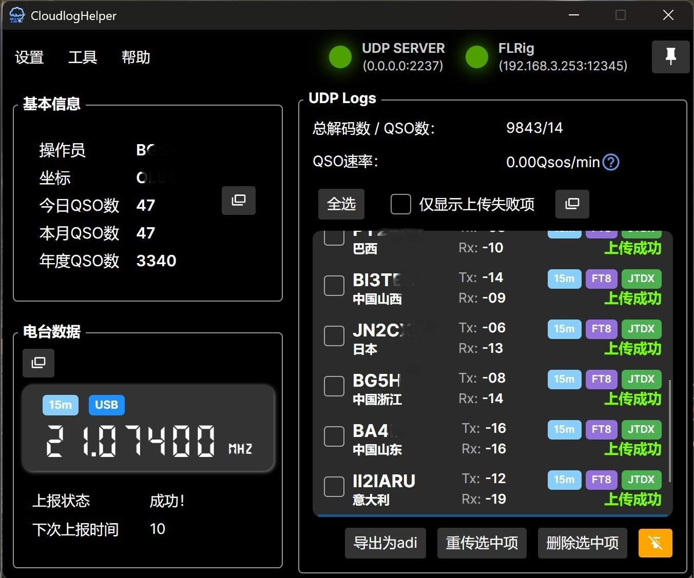
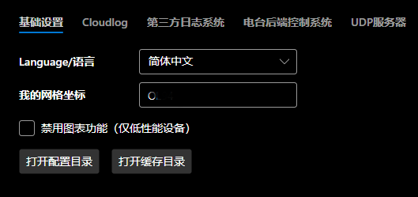
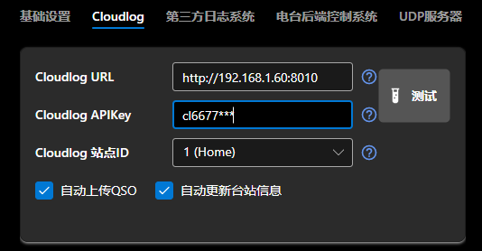
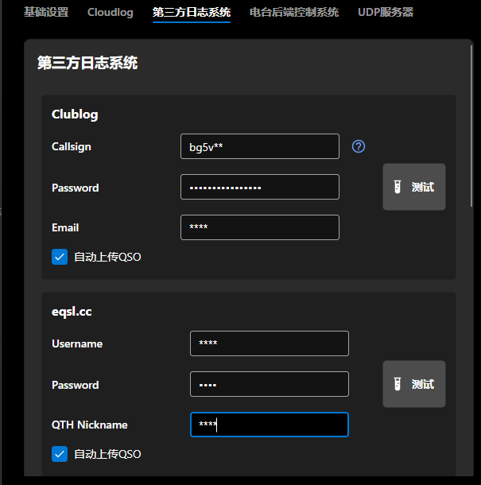
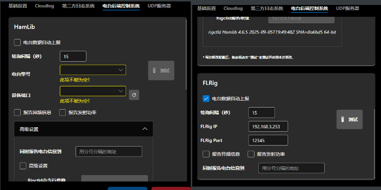
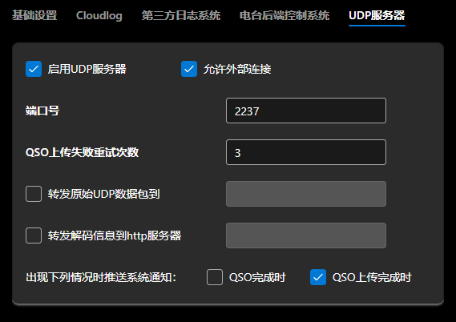
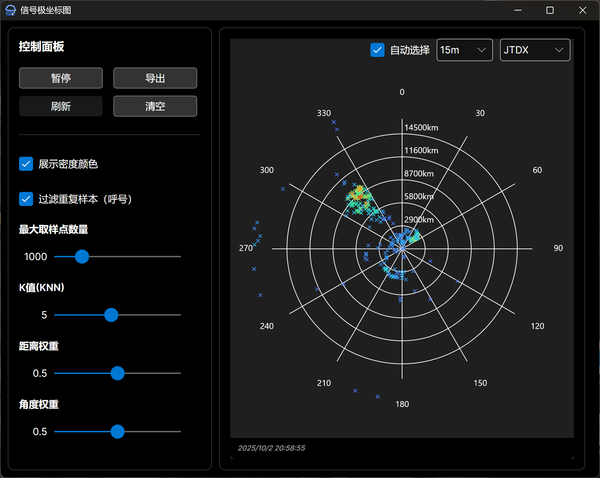
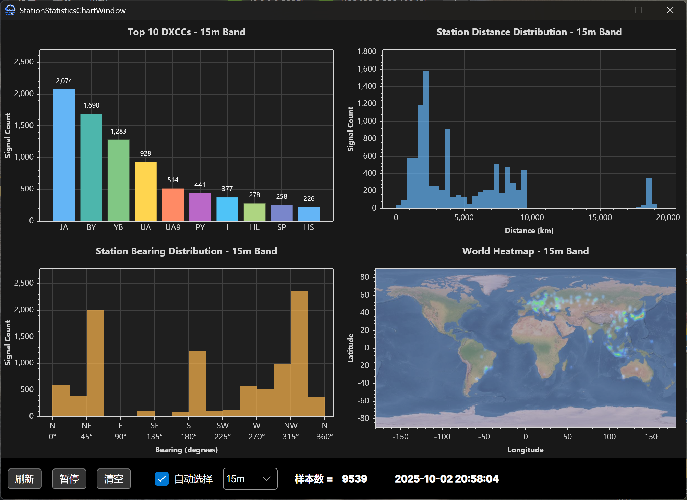

<div align="center">


# Cloudlog Helper  [](https://deepwiki.com/SydneyOwl/cloudlog-helper)


<br />

<br />


轻量级、跨平台、无需安装的`Cloudlog`/`Wavelog`辅助程序，自动上传当前电台信息（`FLRig`/`Hamlib`）以及实时QSO数据到多种日志系统，支持大部分主流电台以及与`JTDX`/`WSJT-X`等软件协同工作！

如果您的电脑性能捉襟见肘，或单纯需要一个自动化QSO/电台信息上传工具，不妨来试试`Cloudlog Helper`！

  

（部分呼号已作隐藏处理）

**⚠️ 本项目是一个非官方的社区项目。它未经过 Cloudlog/Wavelog 开发团队的认可、直接附属、维护或赞助。**

</div>

## 💻 支持的平台

+ Windows 7 SP1+
+ Debian 9+ / Ubuntu 18.04+ / 其他发行版(glibc >= 2.24)
+ 正在适配macOS...

## ⚡️ 快速开始!

> [!TIP]
> 您也可以选择自行编译，请参照下文的`编译`章节。

+ 从`Release`中下载对应系统版本的软件。如果您使用Linux且**需要使用hamlib后端的**电台数据上报功能，请使用sudo启动软件。

+ 打开软件，点击`设置`->`基础设置`打开设置页面。

### 📌 基础设置

请在此填写您的梅登海格坐标（四位）。



### 📌 Cloudlog/Wavelog配置

输入您的Cloudlog / Wavelog服务器（下称Cloudlog）地址以及对应的API KEY，并点击“测试”，如您输入正确，在apikey下方将出现选择站点ID的下拉框。如果您在Cloudlog /Wavelog设置了多个站点请在此选择正确的id，后续的QSO都将上传到此id中。



### 📌 第三方日志系统配置

> [!NOTE]
>
> 您也可以自行增加自己的日志服务，详见下文。

本软件支持上传日志到:

+ Cloudlog / Wavelog
+ Clublog
+ eqsl.cc
+ HamCQ
+ HRDLOG
+ LoTW
+ QRZ.com

在对应位置输入您的呼号/密码或其他配置信息即可。




### 📌 电台配置

> [!NOTE]
>
> 如果您不需要电台数据自动上传功能，可直接忽略这一步。

> [!WARNING]
>
> 您只能选择Hamlib或FLRig中的一种作为电台后端控制系统，两者无法同时启用。

本软件支持`Hamlib`和`FLRig`作为电台的控制后端，可以定时上传电台信息（频率、模式等）到您的Cloudlog服务器、HRDLog或您指定的其他后端。当您需要记录QSO信息时，Cloudlog会自动获取当前的频率、模式等数据，并自动填充至对应输入框中，避免手动输入错误。同时，Cloudlog 主界面中也会实时显示电台的 频率、模式等信息，方便操作时参考。




> [!WARNING]
>
> 如您**使用Hamlib**作为控制后端，由于在开启JTDX（或WSJT-X，下称JTDX）后，电台的控制权将被JTDX独占，因此在未设置JTDX前，此功能和JTDX不能同时启用。可查看`与JTDX协同工作`部分获取解决方法。

+ 在`电台型号`下拉框中选择您使用的电台的型号。
+ 在`设备端口`中选择您的设备所在的端口。
+ 点击“测试”按钮。测试无误后方可勾选“电台数据自动上报”。点击“确认”保存配置。

  

+ 软件主界面应该出现了读取到的电台相关信息。打开您的Cloudlog网站，主页应该出现了您的电台信息：

  

+ 在"Station"中选择您的电台。此后，在您填写QSO信息时，Cloudlog都将自动帮您填充频率、模式等信息。

  

### 📌 UDP服务器配置

此部分的工作原理类似`GridTracker`，`JTDX`会通过 UDP 协议 广播当前解码的呼号、频率、信号报告等信息，而`CloudlogHelper`
将接收这些信息并解码，将通联结果实时上传至您的Cloudlog服务器。

+ 此部分不须过多配置，如果您更改了此部分的端口号，请同步更改JTDX中的UDP服务器配置。**注意，如果JTDX和Cloudlog
  Helper不在同一台机器上运行，您需要勾选“允许外部连接”选项，并更改JTDX中UDP服务器的ip地址部分为运行Cloudlog Helper机器的ip。**
  
  
  
+ 此后，当JTDX处于发射模式，或完成了一个QSO之后，软件主界面都会显示对应信息。


## 🚀 高级

### 📊 图表 - 信号分布极坐标图

此图表在极坐标上展示已收到信号的方位角和距离分布情况，其中**极坐标原点**是您在设置中输入的 **“我的梅登黑德网格”** 所对应的地理位置。

计算出的距离为**大圆距离**，角度为**真北方位角**，信号点颜色越深表示该区域通信越密集。例如通过下图可以直观看出大部分信号来自欧洲、日本和印尼方向。

当勾选了“自动选择”且收到来自`wsjt-x`或`jtdx`的状态信息时，图表将自动切换波段并显示符合条件的QSO分布。



| 配置项         | 说明                                                         |
| -------------- | ------------------------------------------------------------ |
| 展示密度颜色   | 按照给定的k值、距离和角度权重，根据KNN算法计算出每个信号点的密度估计值，根据选定的色图，将密度值映射为对应的颜色，最终在极坐标图上以热力图的形式呈现。此步骤性能消耗较大，当数据量过大或设备性能差时可以关闭。 |
| 过滤重复样本   | 按照呼号剔除重复数据。                                       |
| 最大取样点数量 | 在极坐标上展示的信号点数量，建议1000个以内，最大支持8000个。 |
| K值            | K近邻算法参数，影响密度计算的精度。                          |
| 距离权重       | 距离在密度计算中的权重。                                     |
| 角度权重       | 角度在密度计算中的权重。                                     |

### 📊 图表 - 站点统计

从左到右，从上到下，展示的图表依次为：

+ 解码出的前10位DXCC
+ 站点距离分布
+ 站点方位分布
+ 世界范围内的热力图

同样地，当勾选了“自动选择”且收到来自`wsjt-x`或`jtdx`的状态信息时，图表将自动切换波段并显示符合条件的QSO分布。



### 🔧 实用工具 - QSO上传助手

此工具能够自动从您的Cloudlog服务器上下载已上传的QSO，并与本地QSO(**目前仅支持Wsjtx和JTDX格式的日志**)
进行对比，筛选出未上传的QSO并帮您自动上传补齐。例如您启动了jtdx， 但是忘记启动日志记录软件，或者网络不小心断开了没发现，
这时候就会存在遗漏 QSO 没上传的情况。此工具旨在解决这一问题。

  

| 配置项                     | 说明                                                                                                                                                      |
|-------------------------|---------------------------------------------------------------------------------------------------------------------------------------------------------|
| Execute sync on startup | 如果勾选了此项，则在每次启动软件时都会首先打开这一工具并自动开始同步。                                                                                                                     |
| Username                | Cloudlog的登陆用户名。                                                                                                                                         |
| Password                | Cloudlog的密码。                                                                                                                                            |
| Cloud Sample (days)     | 从Cloudlog上按照天数下载的最新的QSO数量，这些QSO将作为基准数据，用于与本地QSO进行对比。<br/>请按照自己的需求设置。如果通联不频繁，这个值应当适当大一些以确保下载的云端QSO样本量足够覆盖本地QSO。**例如设为 `10` 表示工具会获取云端最新的 10 天内的 QSO 记录。** |
| Local Sample (QSOs)     | 从本地日志文件读取的最近 QSO 记录数量，用于与云端记录对比。例如设为 `50` 表示工具会检查本地最新的 50 条 QSO 是否都已上传到云端（即是否在从云端下载的，数量为Cloud Sample的最新QSO中都存在）。                                        |
| Local Log Paths         | 本地的日志路径。                                                                                                                                                |

### 🎯（仅Hamlib） 与JTDX/Wsjt-x协同工作

如果您希望在开启JTDX的情况下实时上报电台数据，请参考以下内容。Wsjt-x的操作过程与此类似。

当您开启JTDX后，电台的控制权将被JTDX独占，此时您将无法通过本软件读取电台频率。幸运的是，JTDX和本软件均可以使用Rigctld作为电台的控制后端，您只需修改一下JTDX中的网络服务器地址，使本软件和JTDX共享一个Rigctld后端即可。

> [!IMPORTANT]
>
> 请勿将JTDX和本软件的轮询间隔设置得过小，太频繁的数据请求可能导致电台来不及反应导致出错。一个建议值是在JTDX的设置-电台中设置时间间隔为8s，本软件的轮询间隔为15s。**请注意，两者不能为整数倍数**

具体做法如下（以Windows7为例）：

+ 打开Cloudlog Helper，进入“设置”页面，填写电台相关信息后勾选“电台信息自动上报”。注意，**不要**勾选`禁用PTT控制`
  。JTDX依赖此功能控制电台发射。

+ 点击“应用更改”。

+ 打开`JTDX`，进入`设置`-`电台`，将`无线电设备`更改为`Hamlib NET rigctl`，CAT控制中的网络服务器填写rigctld后端地址（默认为127.0.0.1:4534），PTT方法保持原配置不变.
  
  
  
+ 测试CAT和PTT均可用后，点击“确定”。

+ 现在您就成功实现了CloudlogHelper和JTDX的协同工作。

  


### 🎯 各配置项说明

#### ⚙️ Hamlib配置

| 配置项              | 说明                                                                                                                                                |
|------------------|---------------------------------------------------------------------------------------------------------------------------------------------------|
| 电台数据自动上报         | 如此项被勾选，软件将自动上传获取到的电台信息到指定的cloudlog服务器。                                                                                                            |
| 轮询间隔             | 指定向rigctld后端获取电台数据的时间间隔。默认为9秒。                                                                                                                    |
| 电台型号             | 目前使用电台的型号。型号列表从rigctld中读取，因此理论上只要hamlib支持的电台本软件均支持。                                                                                               |
| 设备端口             | 电台所在的端口。                                                                                                                                          |
| 报告异频信息           | 在轮询时向rigctld请求异频（在接收和发射时使用不同频率）信息。**部分电台不支持此功能或读取的数据有误。**                                                                                         |
| 报告发射功率           | 在轮询时向rigctld请求当前的发射功率。**部分电台不支持此功能或读取的数据有误。**                                                                                                     |
| 高级设置-rigctld命令行参数 | 手动指定启动rigctld后端的命令行参数。此项具有最高的优先级，如果此项不为空，其他相关配置（禁用PTT控制/允许外部控制）均会被忽略。**如果您选择手动指定命令行参数，则必须显式指定rigctld的ip地址和端口（-T <ip> -t <port>）,软件将从命令行参数中port。** |
| 高级设置-禁用PTT控制     | 在启动时禁用rts和dtr控制（增加参数`--set-conf=""rts_state=OFF"" --set-conf ""dtr_state=OFF"" `）。仅在部分Lnux上需要启用。如需与JTDX等第三方软件协同工作，此选项不应该勾选。                       |
| 高级设置-允许外部控制      | 允许从localhost以外的设备与rigctld后端交互（增加参数 `-T 0.0.0.0` ）。                                                                                                |
| ~~高级设置-允许请求代理~~  | ~~启动一个代理服务器，可以将外部的请求代理至软件中，由软件按照优先级按顺序自动发送至rigctld。~~                                                                                             |
| 使用外部rigctld服务    | 使用外部的rigctld作为软件的rigctld后端。例如您手动启动了一个rigctld实例，就可以勾选此选项，配置软件使用您指定的rigctld后端。                                                                      |
| 同时报告电台信息         | 将获取到的电台信息同时上报到指定URL。可以同时输入多个，用分号分开，例如“http://a.com/api;http://b.com/rig;http://c.cn/a”。可在`Demo/go`中查看示例。                      |

#### ⚙️ FLRig配置

与` Hamlib配置`类似，此处不再赘述。

#### ⚙️ UDP服务器配置

| 配置项                   | 说明                                                         |
| ------------------------ | ------------------------------------------------------------ |
| 启用UDP服务器            | 启动一个UDP服务器，用于接收来自第三方软件发送的QSO数据。     |
| 端口号                   | UDP服务器的端口号。                                          |
| 允许外部连接             | 允许接收localhost以外的设备发来的请求。                      |
| QSO上传失败重试次数      | 指定QSO上传失败重试次数。                                    |
| 转发原始UDP数据包        | 转发收到的UDP数据包到指定的UDP服务器，例如GridTracker。      |
| 转发解码信息到http服务器 | 转发解码后的数据包，以json形式发送到指定的TCP服务器。可在`Demo/go`中查看示例。 |

#### ⚙️ 命令行参数

| 配置项                 | 说明                            |
|---------------------|-------------------------------|
| `--verbose`         | 打印Trace级别的日志。                 |
| `--log2file`        | 将日志记录到文件。路径为`./log/xxxx`      |
| `--reinit-db`       | 重新初始化数据库。                     |
| `--reinit-settings` | 重新初始化设置。                      |
| `--reinit-hamlib`   | 重新初始化hamlib。                  |
| `--dev`             | 不启动崩溃日志搜集窗口。                  |
| `--udp-log-only`    | 只启用UDP日志上传功能，其他功能隐藏。          |
| `--crash-report`    | 指定崩溃日志收集模块读取临时日志的目录。仅供程序内部调用。 |

#### ⚙️ 快捷键

| 按键   | 说明                                  |
|------|-------------------------------------|
| Ctrl | 在启动页面消失前快速按下3次Ctrl，程序将删除所有设置并重新初始化。 |

## 🛠️ 编译

请首先确保编译环境已具备`.net 6.0`(或以上) 以及`gcc`。以下步骤仅适用于Linux x64环境。

首先，克隆本仓库：

```shell
git clone --depth=1 https://github.com/SydneyOwl/cloudlog-helper.git
```

### 🔨 编译Hamlib

如果您完全不需要读取和上传电台信息，可以直接忽略这一步，软件可以在没有hamlib的情况下工作。

事实上我们只需要`rigctld`，它是`Hamlib`工具集中的一个无线电控制守护进程，允许通过TCP长连接远程控制无线电设备:

```shell
# Clone hamlib
git clone --depth=1 https://github.com/hamlib/hamlib.git

# 依赖安装
sudo apt install build-essential gcc g++ cmake make libusb-dev libudev-dev autoconf automake libtool

cd cloudlog-helper/hamlib
./bootstrap

# 减小编译产物体积， 参考了wsjt-x的cmakelist
./configure --prefix=<INSTALL_DIR> --disable-shared --enable-static --without-cxx-binding \
CFLAGS="-g -O2 -fPIC -fdata-sections -ffunction-sections" \
LDFLAGS="-Wl,--gc-sections"

make -j$(nproc) all
make install-strip DESTDIR=""
```

编译完成后，您应该可以在`./<INSTALL_DIR>/bin`处找到编译产物`rigctld`。请将它放到Resources/Dependencies/hamlib/linux-64中，后续rigctld将嵌入到编译的软件中。您也可以从[hamlib-crossbuild](https://github.com/SydneyOwl/hamlib-crossbuild)直接下载对应架构的rigctld。

### 🔨 编译软件本体

请执行以下命令:

```shell
cd cloudlog-helper
dotnet publish -c Release -r linux-x64 -f net6.0 -p:PublishSingleFile=true \
--self-contained true -p:PublishReadyToRun=true -p:PublishTrimmed=true -p:IncludeNativeLibrariesForSelfExtract=true \
-p:UseAppHost=true
```

编译完成后，您应该可以在`bin/Release/net6.0/linux-64`找到编译的软件.

## ✨ 其他

### ⬆️ 升级Cloudlog Helper

+ v0.2.0及之后： 无需其他操作，直接下载最新版的Cloudlog Helper，双击打开即可。

+ v0.1.5及以前： 如果您需要保留之前的数据，请将软件产生的数据库文件(cloudlog-helper.db)和设置文件(settings.json)复制到新的配置目录（不存在请新建，对于windows，这个目录在`C:\Users\<用户名>\AppData\Local\CloudlogHelper`，Linux则在
  `/home/<用户名>/.config/CloudlogHelper`)。
  由于版本变动较大，设置中可能仍有部分字段缺失，请您手动补全~

### 🗑️ 卸载Cloudlog Helper

+ v0.2.0及之后： 删除CloudlogHelper（v0.2.0后为单文件），并删除`C:\Users\<用户名>\AppData\Local\CloudlogHelper`(windows) 或 `/home/<用户名>/.config/CloudlogHelper`（linux）。

+ v0.1.5及以前： 直接删除Cloudlog Helper所在文件夹即可。

### 🔍 集成其他日志系统

如果您有集成其他日志系统到软件中的需求，可参考`LogService`中的相关配置。如您有过C#开发经验，应该能够轻松地完成新配置的添加。
（添加后可以考虑提个PR~）

CloudlogHelper 使用基于属性的系统来定义日志服务，使开发者能够轻松地添加新的日志服务。每个日志服务都继承自`ThirdPartyLogService`，并使用特定的Attribute来定义其配置。程序会自动发现带有 LogServiceAttribute 的类，同时UI会自动生成配置界面（UserInputAttribute 标注的字段）。简单来说，您只需完成这三步：

+ 创建继承自`ThirdPartyLogService`的类，并用 `[LogService("服务名")]` 标注。
+ 为每个需要用户配置的字段（如API密钥、用户名等）添加属性，并用 `[UserInput("显示名")]` 标注。
+ 实现两个方法，用于测试与服务端的连接是否正常 以及 将QSO数据上传到日志服务。您可以不用处理方法中可能出现的异常。

### 📡 自定义后端支持

除了上报到 Cloudlog，还可将电台实时数据（频率、模式等）同时推送至您自己的服务器或 API，满足您二次开发的需求。
数据格式如下（json）:
```json5
{
  "key": null, // 保留字段 请忽略
  "radio": "G90", // 电台名称
  "frequency": 14020000,// （以Hz为单位的）发射频率
  "mode": "CW", // 发射模式
  "frequencyRx": 14020000, // 接收频率，仅当“报告异频”启用时，否则为null
  "modeRx": "CW", // 接收模式，仅当“报告异频”启用时，否则为null
  "power": 10.0 // 发射功率，仅当“报告功率”启用时，否则为null
}
```

收到数据后，您应当以字符串形式回复"OK"，否则软件将视为数据推送失败并提示。

您可以在“Demo”文件夹中查看示例。

### 🐆 性能分析

此处简单模拟了一个远程挂机FT8的应用场景，在低端设备上测试，操作系统为64位的Windows 7 SP1, CPU为i5-3337u，内存8G。

系统上运行`Rustdesk` + `JTDX` + `Cloudlog helper` + `NetTime v3.14`。

挂机1小时后的CPU和内存占用如下，其中的CPU尖峰为某周期接收结束后的解码操作。


## ❓ 已知问题

+ 在Win7和Linux上双击QSO查看详情功能失效。

## 🙏 致谢

+ [Hamlib](https://github.com/Hamlib/Hamlib): 业余无线电设备控制库（支持电台、旋转器、调谐器及功放） （GPL, LGPL, 以二进制文件形式调用）
+ [WsjtxUtils](https://github.com/KC3PIB/WsjtxUtils): 基于 C# 的类库及示例代码，通过 .NET & .NET Framework 4.8 的 UDP 接口与
  WSJT-X 交互 （MIT）
+ [ADIFLib](https://github.com/kv9y/ADIFLib): 用于读取、解析和写入 ADIF（版本 3.1.0）文件的 C# 库。 (MIT)
+ [FT8CN](https://github.com/N0BOY/FT8CN): 在安卓上运行FT8。本软件的呼号归属解析逻辑以及对应的DXCC中文翻译提取自此软件。 (MIT)
+ [Cloudlog](https://github.com/magicbug/Cloudlog): 基于网络的业余无线电记录应用程序, 本软件图标由此项目图标修改而来。（MIT）

## 📝 许可证

`Cloudlog Helper`是释放至公共领域的免费无约束软件。任何人可出于任何目的（商业或非商业），以任何形式（源代码或编译文件），自由地复制、修改、发布、使用、编译、出售或分发本软件。

完整的许可证信息请参考仓库中的[Unlicense](./LICENSE)文件。

## ⚠️ 免责声明

1. 软件使用
   Cloudlog Helper 是一款免费的开源软件，旨在为业余无线电爱好者提供便捷的 Cloudlog/Wavelog
   辅助功能。用户可自由下载、使用或修改本软件，但所有使用行为均需自行承担风险。开发者及贡献者不对因使用本软件导致的任何直接或间接损失负责，包括但不限于：

    + 数据丢失或损坏
    + 电台设备异常或故障
    + 网络通信问题
    + 其他因软件兼容性、配置错误或操作不当引发的后果

2. 功能限制

    + 测试阶段声明：本软件目前处于测试阶段（UNDER TESTING），可能存在未发现的缺陷或功能不稳定性。建议用户在使用前备份重要数据，并避免完全依赖本软件进行关键操作。
    + 第三方依赖：本软件依赖 Hamlib、JTDX/WSJT-X 等第三方库或工具，其功能及兼容性受限于这些组件的支持范围。开发者无法保证所有设备或软件的适配性。

3. 数据安全与隐私
    + 用户需自行确保输入的 Cloudlog/Wavelog API Key、Clublog 账户信息等敏感数据的安全性。本软件不会主动收集或存储这些信息，但因用户设备或网络环境导致的数据泄露风险需由用户自行承担。
    + 通过 UDP 服务器接收的 QSO 数据默认仅在本地处理，启用“允许外部连接”功能可能增加安全风险，请谨慎配置。

4. 设备操作风险
    + 使用 Hamlib 控制电台时，请确保遵循设备制造商的操作规范。错误的轮询间隔或配置可能导致电台异常。建议首次使用时在不连接电台的情况下测试功能。
    + 与 JTDX/WSJT-X 等软件协同工作时，需注意避免端口冲突或控制权竞争问题。开发者不承担因配置错误导致的设备损坏责任。
